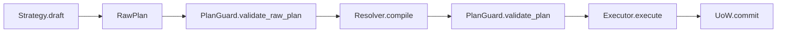

# Operations API

SemaFS 维护链路分两类操作对象：

1. **Raw ops**（LLM 原始输出）
2. **Resolved ops**（可执行计划）

## Raw Ops (`core/raw.py`)

- `RawMerge(source_ids, new_content, new_name, evidence)`
- `RawGroup(source_ids, category_name, category_summary, category_keywords)`
- `RawMove(leaf_id, target_name)`
- `RawRename(node_id, new_name)`
- `RawRollup(source_ids, rollup_summary, rollup_keywords, highlights, window_label)`

容器：

```python
@dataclass(frozen=True)
class RawPlan:
    ops: tuple[RawMerge | RawGroup | RawMove | RawRename | RawRollup, ...]
    updated_summary: str | None = None
    updated_keywords: tuple[str, ...] = ()
    updated_name: str | None = None
    reasoning: str | None = None
```

## Resolved Ops (`core/ops.py`)

- `MergeOp(source_ids, new_content, new_name)`
- `GroupOp(source_ids, category_path, category_summary, category_keywords)`
- `MoveOp(leaf_id, target_path)`
- `RenameOp(node_id, new_name)`
- `RollupOp(source_ids, rollup_summary, rollup_keywords, highlights, window_label)`
- `ArchiveOp(source_ids, reason)`

容器：

```python
@dataclass(frozen=True)
class Plan:
    ops: tuple[MergeOp | GroupOp | MoveOp | RenameOp | RollupOp | ArchiveOp, ...]
    updated_summary: str | None = None
    updated_keywords: tuple[str, ...] = ()
    updated_name: str | None = None
    reasoning: str | None = None
```

辅助方法：

- `is_empty()`
- `has_summary_update()`
- `has_keywords_update()`
- `has_name_update()`

## Execution Chain



## See Also

- [Strategy](/api/strategy)
- [Maintenance Design](/design/maintenance)
