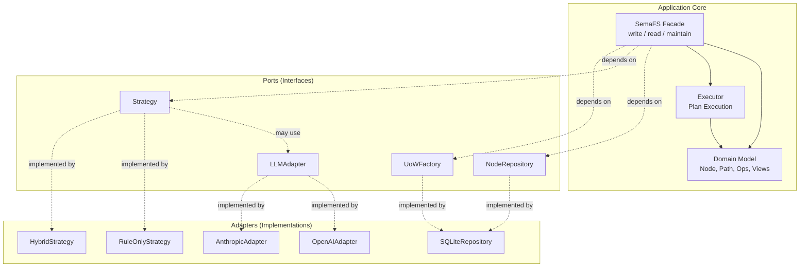
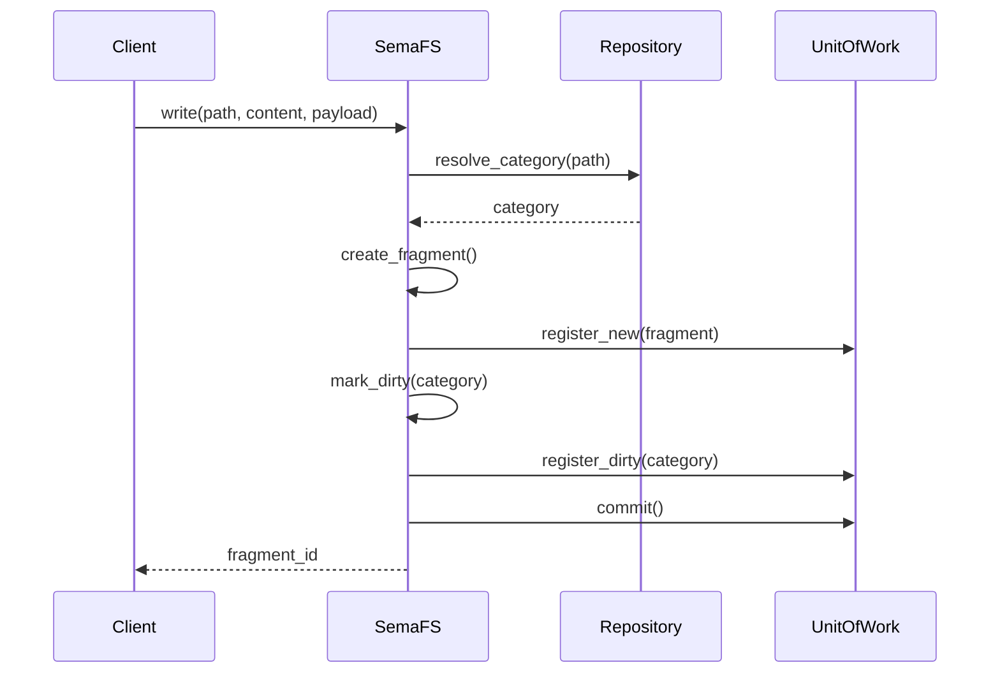
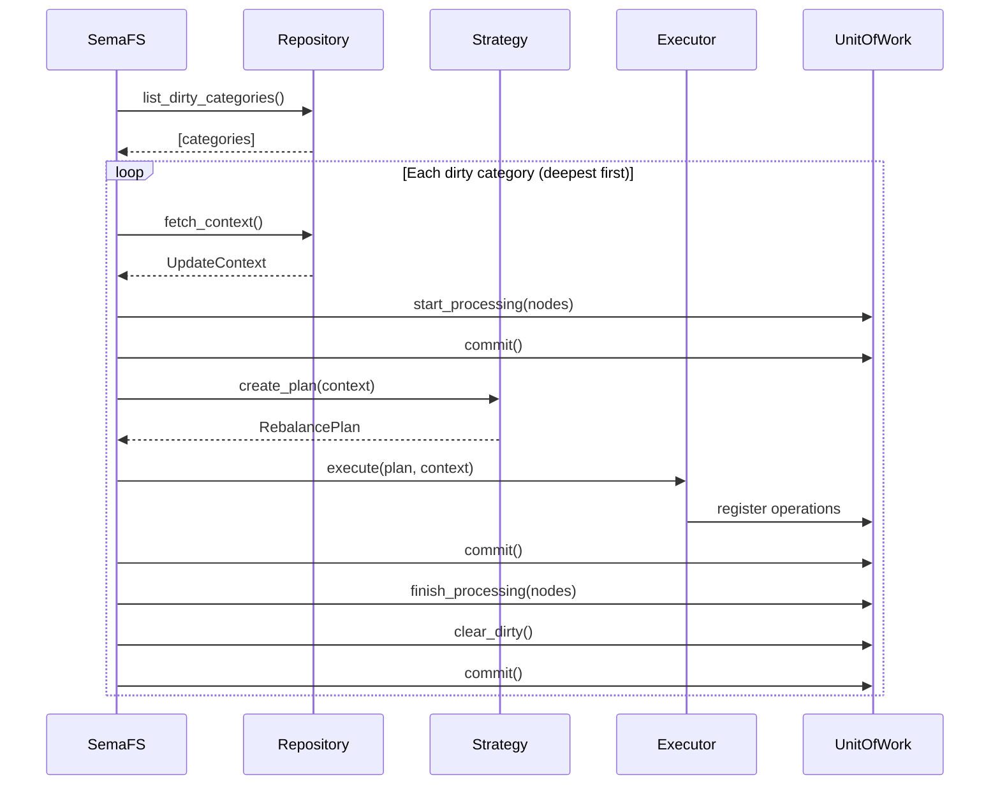
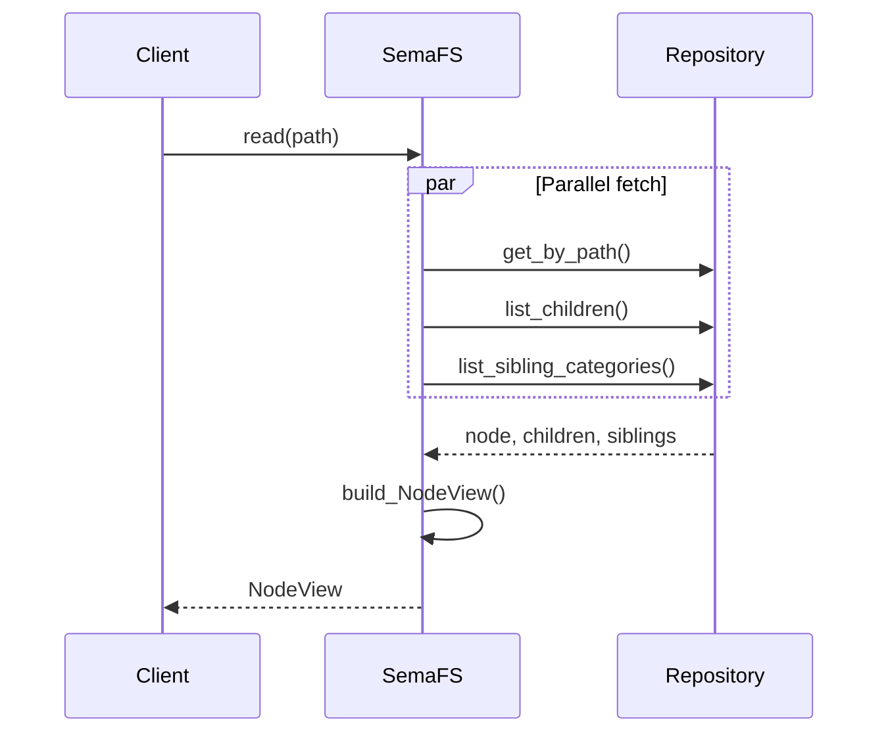
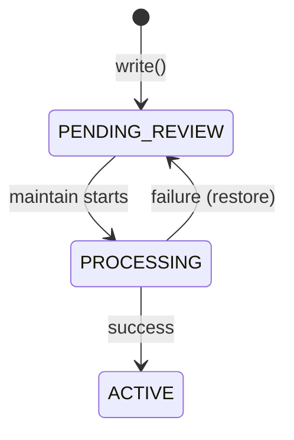

# Architecture

System design overview of SemaFS.

## Design Philosophy

SemaFS is built on three core principles:

1. **Separation of Concerns**: Domain logic, storage, and LLM are independent
2. **Explicit Dependencies**: All dependencies injected, no globals
3. **Graceful Degradation**: System works even when LLM fails

## Hexagonal Architecture



### Benefits

| Aspect | Benefit |
|--------|---------|
| **Testing** | Mock any adapter for unit tests |
| **Flexibility** | Swap SQLite for PostgreSQL without code changes |
| **LLM Agnostic** | Switch between OpenAI, Anthropic, local models |
| **Upgradability** | Replace components independently |

## Layer Responsibilities

### Domain Layer (`semafs/core/`)

Pure business logic with no external dependencies.

```
core/
├── node.py       # TreeNode, NodePath
├── ops.py        # MergeOp, GroupOp, MoveOp, PersistOp
├── views.py      # NodeView, TreeView, StatsView
├── enums.py      # NodeType, NodeStatus, OpType
└── exceptions.py # Domain exceptions
```

**Rules**:
- No imports from infrastructure
- No async I/O (except in protocols)
- Immutable value objects where possible
- Rich domain behavior on entities

### Application Layer (`semafs/`)

Orchestrates domain objects and coordinates infrastructure.

```
semafs/
├── semafs.py     # Main facade (SemaFS class)
├── executor.py   # Plan execution engine
├── uow.py        # Unit of Work
└── renderer.py   # View to output formatters
```

**Responsibilities**:
- Transaction coordination
- Workflow orchestration
- Error handling and recovery

### Ports Layer (`semafs/ports/`)

Interfaces defining required capabilities.

```
ports/
├── repo.py       # NodeRepository protocol
├── strategy.py   # Strategy protocol
├── llm.py        # LLMAdapter protocol
└── factory.py    # UoWFactory protocol
```

**Design**:
- Python `Protocol` classes
- No implementation details
- Stable contracts for adapters

### Adapters Layer (`semafs/{storage,infra,strategies}/`)

Concrete implementations of ports.

```
storage/sqlite/   # SQLite repository
infra/llm/        # OpenAI, Anthropic adapters
strategies/       # Rule and Hybrid strategies
```

**Rules**:
- Implement exactly one port
- Handle infrastructure concerns (network, disk)
- Translate between domain and external formats

## Data Flow

### Write Flow



### Maintain Flow



### Read Flow



## Key Design Decisions

### 1. Async-First

All I/O operations are async:

```python
# Good: Non-blocking
async def write(self, path, content, payload):
    await self._resolve_category(path)
    await uow.commit()

# Why: Enables concurrent maintenance, responsive API
```

### 2. Unit of Work Pattern

Changes are staged, then committed atomically:

```python
# All changes staged
uow.register_new(node1)
uow.register_dirty(node2)

# Single atomic commit
await uow.commit()
```

**Benefits**:
- Transaction safety
- Easy rollback on failure
- Clear change boundaries

### 3. Context Snapshots

Maintenance uses frozen context:

```python
context = UpdateContext(
    parent=category,
    active_nodes=tuple(active),   # Frozen
    pending_nodes=tuple(pending)  # Frozen
)
```

**Benefits**:
- No phantom reads during processing
- Consistent LLM prompts
- Safe concurrent access

### 4. Strategy Pattern for LLM

LLM usage is a pluggable strategy:

```python
# Development: No LLM
semafs = SemaFS(factory, RuleOnlyStrategy())

# Production: Smart LLM
semafs = SemaFS(factory, HybridStrategy(adapter))
```

**Benefits**:
- Easy testing without API costs
- Gradual LLM adoption
- Fallback on failures

### 5. Semantic Floating

Changes propagate upward:

```python
if plan.should_dirty_parent:
    grandparent.request_semantic_rethink()
```

**Benefits**:
- Parent summaries stay coherent
- Deep changes trigger reanalysis
- Emergent organization

## Error Handling

### Recovery Levels

| Level | Scope | Recovery |
|-------|-------|----------|
| **Operation** | Single op | Skip invalid IDs |
| **Category** | One category | Rollback, mark for retry |
| **LLM** | API call | Fallback to rules |
| **System** | Whole maintain | Log errors, continue |

### Status-Based Recovery



Failed processing restores original status.

## Performance Characteristics

| Operation | Complexity | Notes |
|-----------|------------|-------|
| write() | O(depth) | Path resolution |
| read() | O(1) | Direct lookup |
| list() | O(children) | Single query |
| view_tree() | O(nodes) | Recursive fetch |
| maintain() | O(dirty × LLM) | LLM is bottleneck |

### Optimizations

1. **Parallel context fetch**: `asyncio.gather()` for context building
2. **Depth-limited ancestors**: Max 3 levels for LLM context
3. **Batch dirty processing**: Amortize LLM costs
4. **Index-optimized queries**: Proper DB indexes

## Extension Points

### Adding a Storage Backend

1. Implement `NodeRepository` protocol
2. Implement `UoWFactory` protocol
3. Handle atomic transactions
4. Support cascade rename

### Adding an LLM Provider

1. Implement `BaseLLMAdapter` protocol
2. Format prompts appropriately
3. Parse tool call responses
4. Handle API errors

### Adding a Strategy

1. Implement `Strategy` protocol
2. Provide sync `create_fallback_plan`
3. Return valid `RebalancePlan`

## See Also

- [Data Model](/design/data-model) - Node structure details
- [Maintenance System](/design/maintenance) - Processing flow
- [Transaction Model](/design/transactions) - ACID guarantees
