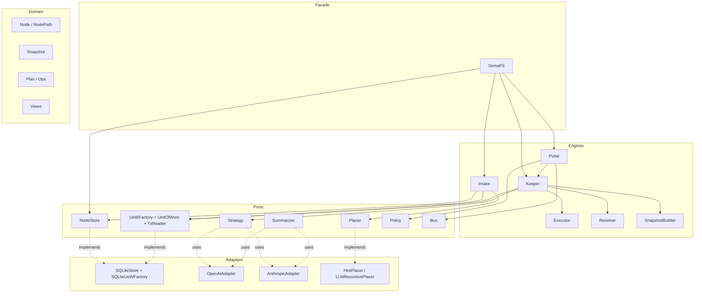

# Architecture

SemaFS 当前架构（v2.1.x）采用“端口-适配器 + 阶段化维护”模式，目标是把**语义决策**与**持久化执行**明确分离。

## System View

## Runtime Flow

### Write Path (fast path)

1. `SemaFS.write(content, hint, payload)`
2. `Intake` 调用 `Placer` 决定目标分类
3. 在 `UnitOfWork` 中写入新叶子（`PENDING`）
4. 提交事务后发布 `Placed` 事件

特点：低延迟、事务边界清晰、写后异步治理。

### Reconcile Path (governance path)

由 `Pulse`（事件）或 `sweep(limit)`（批处理）触发 `Keeper.reconcile`。

`Keeper` 内部按阶段执行：

1. `SnapshotBuilder` 用 `uow.reader` 构建一致性快照
2. `RebalancePhase`：`Strategy.draft -> Guard -> Resolver -> Executor`
3. `RollupPhase`：终端分组/归并（按配置）
4. `PostRebalancePhases`：lifecycle / summary / propagation
5. 事务提交后发布事件，必要时向父级传播

## Why This Architecture

### 1) 决策与执行分离

- 决策层：`Strategy` 只负责“建议”
- 执行层：`Executor + UoW` 负责“可落地变更”
- 价值：降低 LLM 输出不稳定对数据正确性的影响

### 2) 事务内读取优先

- 快照来自 `TxReader`，与提交使用同一事务连接
- 价值：减少并发写下的 stale snapshot 决策

### 3) 阶段化而不是巨型编排器

- 将重平衡、rollup、summary、propagation 拆成 phase
- 价值：复杂度可控、测试粒度清晰、易演进

### 4) Path 投影与 ID 主身份

- `id` 稳定，`canonical_path` 可演进
- `node_paths` 用于路径映射和查询加速
- 价值：支持 rename/move 而不破坏身份语义

## Module Mapping

- `semafs/semafs.py`: facade API
- `semafs/engine/intake.py`: write ingress
- `semafs/engine/keeper.py`: reconcile orchestrator
- `semafs/engine/phases.py`: phase implementations
- `semafs/engine/builder.py`: snapshot builder
- `semafs/engine/resolver.py`: raw-to-plan compile
- `semafs/engine/executor.py`: plan apply
- `semafs/infra/storage/sqlite/*`: store + uow adapter
- `semafs/algo/*`: strategy / placer / summarizer / policy

## Current Boundaries

- `core`: 纯领域对象与规则
- `ports`: 协议定义（依赖方向的中心）
- `engine`: 编排与流程控制
- `infra`: 外部系统适配（SQLite / LLM）
- `algo`: 算法策略（placement/rebalance/summary/propagation）

这组边界保证了：替换 LLM、替换存储、替换策略时，不必改动核心领域模型。
