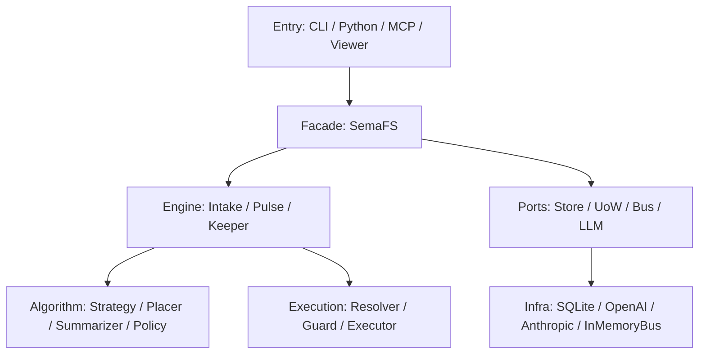
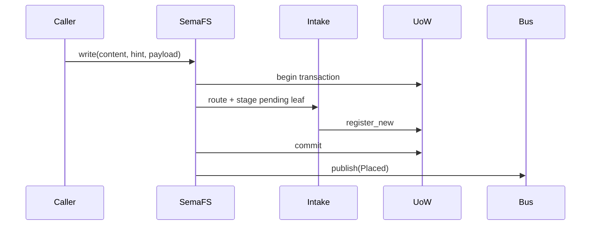
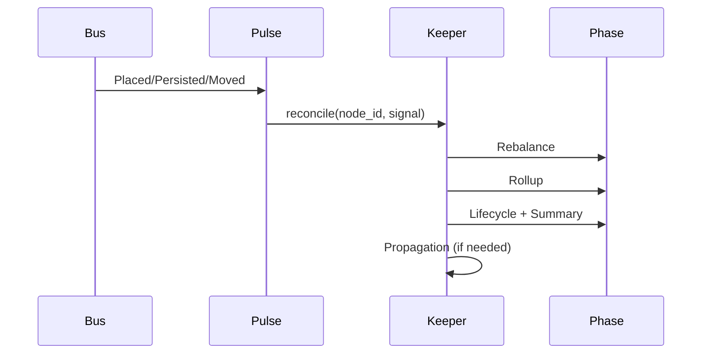

# Architecture Overview

SemaFS uses a layered architecture centered on the `SemaFS` facade.

## 1. Layer Diagram

## 2. Runtime Components

### 2.1 `SemaFS`

Application facade exposing high-level APIs:

- write/read/list/tree/related/stats/sweep/apply_skeleton

### 2.2 `Intake`

Write pipeline component:

- placement routing
- pending leaf staging
- placement payload enrichment

### 2.3 `Pulse`

Event entry component:

- subscribe to selected domain events
- seed propagation signal via policy
- dispatch reconcile to keeper

### 2.4 `Keeper`

Maintenance orchestrator:

- per-node lock management
- reconcile phase coordination
- metric collection
- optional parent propagation

### 2.5 `Resolver + PlanGuard + Executor`

Plan execution stack:

- normalize and resolve names/paths
- enforce semantic/naming guards
- stage transactional mutations

## 3. Default Composition

CLI and MCP runtime initialize with:

- `SQLiteStore`
- `SQLiteUoWFactory`
- `InMemoryBus`
- `HybridStrategy`
- `LLMRecursivePlacer`
- `LLMSummarizer`
- `DefaultPolicy`

## 4. Main Runtime Flows

### 4.1 Write Flow

### 4.2 Reconcile Flow

## 5. Extension Points

Primary customization paths:

- custom `Strategy`
- custom `Placer`
- custom `Summarizer`
- custom `Policy`
- custom `NodeStore` and `UoWFactory`
