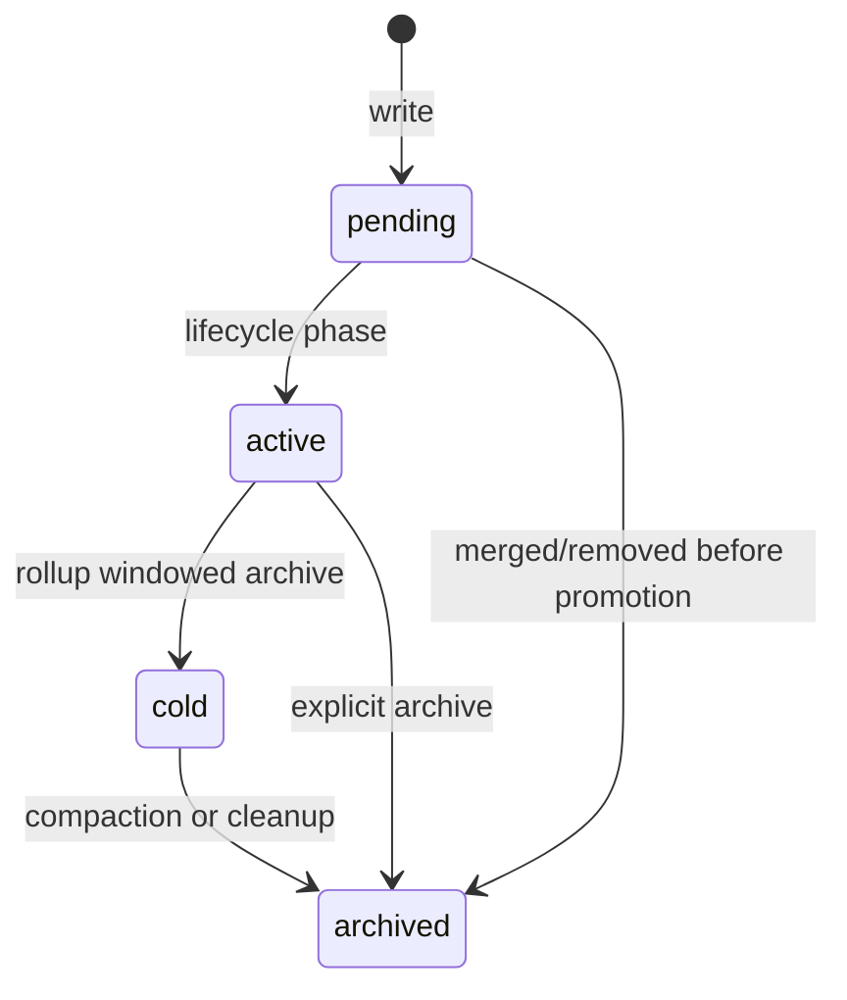

# Data Model

SemaFS 的数据模型围绕两个原则：

1. **Node ID 是主身份**（稳定）
2. **Path 是投影**（可演进）

## Node Schema (Conceptual)

```python
@dataclass(frozen=True)
class Node:
    id: str
    parent_id: str | None
    name: str
    canonical_path: str
    node_type: NodeType           # category | leaf
    content: str | None           # 叶子主内容
    summary: str | None           # 分类摘要
    category_meta: dict           # 分类结构化摘要元数据
    payload: dict                 # 来源、时间、业务字段
    tags: tuple[str, ...]
    stage: NodeStage              # active | pending | cold | archived
    skeleton: bool
    name_editable: bool
```

## Node Types

### CATEGORY

- 语义容器
- 可有子节点
- `summary/category_meta` 表示聚合语义

### LEAF

- 原子知识片段
- 不可有子节点
- `content` 为主体内容

## Lifecycle Stages



- `pending`: 新写入，待治理
- `active`: 可读可参与维护
- `cold`: 已被 rollup 汇总，默认不参与重平衡
- `archived`: 归档态

## Path Model

`NodePath` 规则：

- 根路径固定 `root`
- 合法字符：`[a-z0-9_]` + `.`
- 规范化后全小写

路径相关对象：

- `nodes.canonical_path`: 当前规范路径（唯一）
- `node_paths`: `node_id -> canonical_path` 投影索引

## Storage Layout (SQLite)

核心表：

- `nodes`: 真实节点状态（含 stage、payload、meta）
- `node_paths`: 路径索引与深度信息

关键约束：

- `nodes.id` 主键
- `nodes.canonical_path` 唯一
- `uq_nodes_sibling_name(parent_id, name) where is_archived = 0`

## Why ID-first + Path Projection

当 rename/move 发生时：

- `id` 不变，引用关系稳定
- `canonical_path` 与 `node_paths` 重新投影
- 读 API 仍可通过 path 查询，但内部流程按 id 保持一致性

这可以显著降低重命名/移动导致的级联错误。

## Snapshot Model

维护流程不直接用“实时树”，而是用快照：

```python
@dataclass(frozen=True)
class Snapshot:
    target: Node
    leaves: tuple[Node, ...]
    subcategories: tuple[Node, ...]
    pending: tuple[Node, ...]
    siblings: tuple[Node, ...]
    ancestors: tuple[Node, ...]
    used_paths: frozenset[str]
```

快照由 `SnapshotBuilder` 基于 `uow.reader` 构建，保证“同事务视角”。

## Summary Contract

分类摘要采用 `category_meta -> render_category_summary(meta)` 渲染路径：

- 写库前统一 `normalize_category_meta`
- 叶子节点 `category_meta` 固定为空
- 分类摘要来源统一，减少字符串拼接漂移
