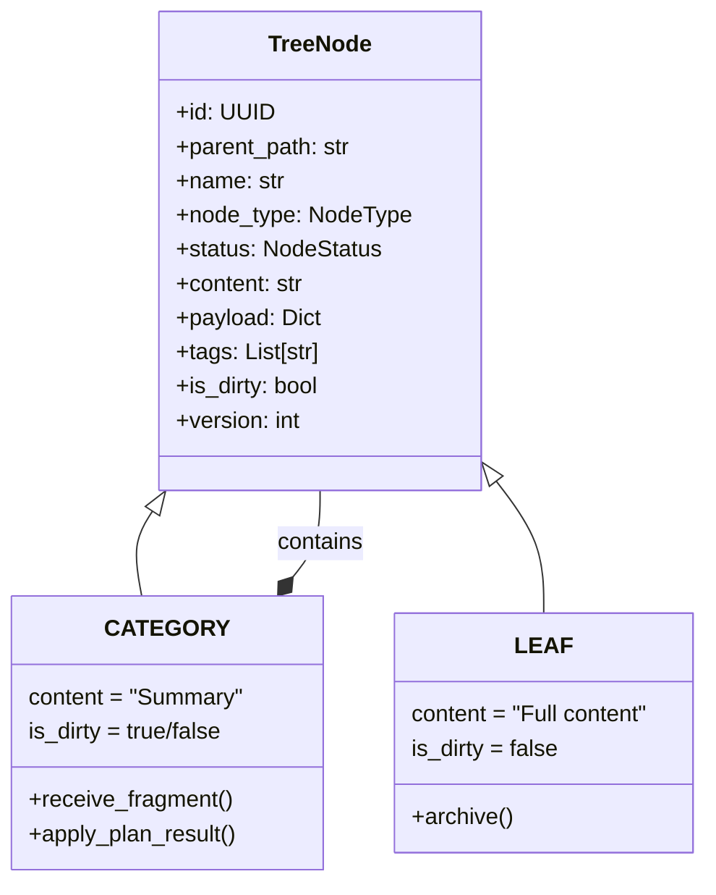
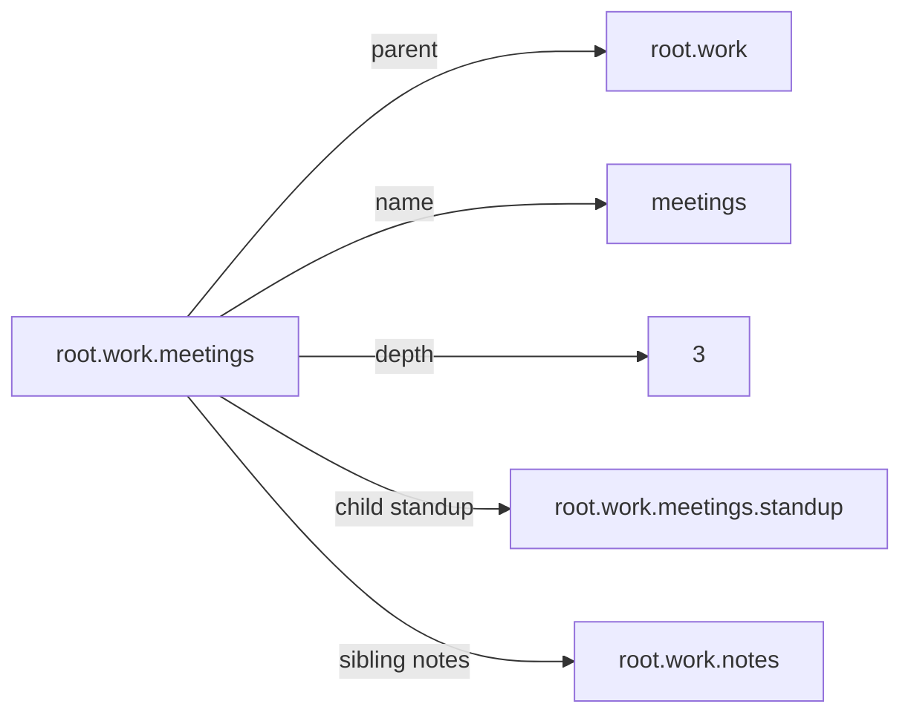
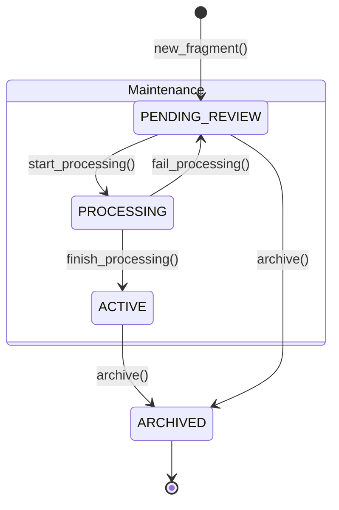
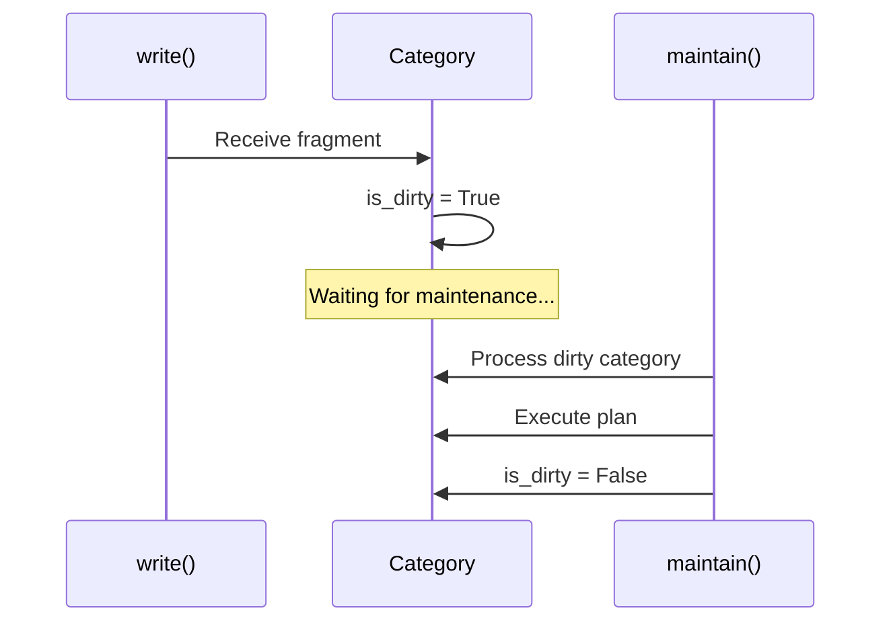

# Data Model

Deep dive into SemaFS's hierarchical data structure.

## Node Types



### CATEGORY Nodes

**Purpose**: Organizational containers for hierarchical structure.

| Property | Semantics |
|----------|-----------|
| `content` | Summary of all descendants |
| `is_dirty` | Needs maintenance processing |
| `children` | Can contain CATEGORY and LEAF |

**Behavior**:
- Receives fragments (marks dirty)
- Applies plan results (updates summary)
- Requests semantic rethink (forces LLM)

### LEAF Nodes

**Purpose**: Terminal nodes with atomic knowledge.

| Property | Semantics |
|----------|-----------|
| `content` | Complete knowledge unit |
| `is_dirty` | Always false |
| `children` | Cannot have children |

**Behavior**:
- Can be archived (soft-delete)
- Created by operations (merge, group, move, persist)

## Path System

### NodePath Value Object

```python
@dataclass(frozen=True)
class NodePath:
    raw: str  # Normalized: lowercase, [a-z0-9_.]
```

**Operations**:



### Path Composition

Paths are stored decomposed for efficient queries:

```
Full path:    root.work.meetings
              ↓
Database:     parent_path = "root.work"
              name = "meetings"
```

**Benefits**:
- Efficient child listing: `WHERE parent_path = ?`
- Unique constraint: `(parent_path, name)`
- Cascade rename: Update `parent_path` prefix

## Node Lifecycle



### Status Semantics

| Status | Query Visible | Modifiable | Transitions To |
|--------|---------------|------------|----------------|
| PENDING_REVIEW | No (maintenance only) | Read-only | PROCESSING, ARCHIVED |
| PROCESSING | No | Locked | ACTIVE, PENDING_REVIEW |
| ACTIVE | Yes | Yes | PROCESSING, ARCHIVED |
| ARCHIVED | Audit only | No | (terminal) |

### Status Recovery

```python
# Before processing
node._original_status = node.status  # Save
node.status = PROCESSING

# On failure
node.status = node._original_status  # Restore
```

## Information Hierarchy

### Precision Gradient

```
Depth ∝ Specificity

root (Depth 0)
├── "Software engineer, coffee lover, travel enthusiast"  ← Overview

├── preferences (Depth 1)
│   ├── "Personal preferences across food, work, travel"  ← Domain
│   │
│   ├── food (Depth 2)
│   │   ├── "Food: coffee enthusiast, Japanese cuisine"  ← Topic
│   │   │
│   │   └── coffee (Depth 3)
│   │       └── "Dark roast, Ethiopian, V60 pour-over,   ← Details
│   │            93°C water, 1:15 ratio"
```

### Content Propagation

Parents summarize children:

```mermaid
graph BT
    C1[coffee: "Dark roast..."]
    C2[tea: "Green tea..."]
    F[food: "Beverages: dark roast coffee, green tea..."]
    P[preferences: "Food and drink preferences..."]

    C1 --> F
    C2 --> F
    F --> P
```

When children change, parent content updates via `apply_plan_result()`.

## Metadata

### Payload

Arbitrary JSON metadata:

```python
payload = {
    "source": "meeting",
    "author": "alice",
    "confidence": 0.95,
    "timestamp": "2024-03-15T10:00:00Z",
    "_force_llm": True,  # Internal flag
    "_merged": True,     # Track history
    "_merged_from": ["id1", "id2"]
}
```

**Preserved through**:
- Merge (combined)
- Move (copied)
- Persist (kept)

### Tags

Classification labels:

```python
tags = ["important", "work", "project-x"]
```

## Dirty Flag System



### Dirty Ordering

Categories processed deepest-first:

```
Dirty categories:     Process order:
- root               4. root
- root.work          2. root.work
- root.work.proj     1. root.work.proj (deepest)
- root.food          3. root.food
```

**Reason**: Child changes should propagate up.

## Database Schema

```sql
CREATE TABLE semafs_nodes (
    -- Identity
    id TEXT PRIMARY KEY,
    parent_path TEXT NOT NULL,
    name TEXT NOT NULL,

    -- Type & Status
    node_type TEXT CHECK(node_type IN ('CATEGORY', 'LEAF')),
    status TEXT CHECK(status IN ('ACTIVE', 'ARCHIVED',
                                  'PENDING_REVIEW', 'PROCESSING')),

    -- Content
    content TEXT,
    display_name TEXT,
    name_editable INTEGER DEFAULT 1,

    -- Metadata
    payload TEXT DEFAULT '{}',
    tags TEXT DEFAULT '[]',

    -- State
    is_dirty INTEGER DEFAULT 0,
    version INTEGER DEFAULT 1,

    -- Audit
    access_count INTEGER DEFAULT 0,
    created_at TEXT,
    updated_at TEXT,
    last_accessed_at TEXT
);
```

### Indexes

```sql
-- Unique non-archived paths
CREATE UNIQUE INDEX idx_unique_path
    ON semafs_nodes(parent_path, name)
    WHERE status != 'ARCHIVED';

-- Child listing
CREATE INDEX idx_parent_path ON semafs_nodes(parent_path);

-- Status queries
CREATE INDEX idx_status ON semafs_nodes(status);

-- Dirty category fetch
CREATE INDEX idx_dirty_categories
    ON semafs_nodes(is_dirty, node_type, status);
```

## Constraints

### Uniqueness

Non-archived nodes must have unique paths:

```sql
UNIQUE(parent_path, name) WHERE status != 'ARCHIVED'
```

**Implication**: Multiple ARCHIVED nodes can share a path (audit trail).

### Path Conflict Resolution

```python
def resolve_path(parent, name):
    if not path_exists(f"{parent}.{name}"):
        return name
    for i in range(1, 100):
        if not path_exists(f"{parent}.{name}_{i}"):
            return f"{name}_{i}"
```

## See Also

- [Architecture](/design/architecture) - System overview
- [TreeNode API](/api/node) - Node class reference
- [Operations](/api/operations) - Tree operations
