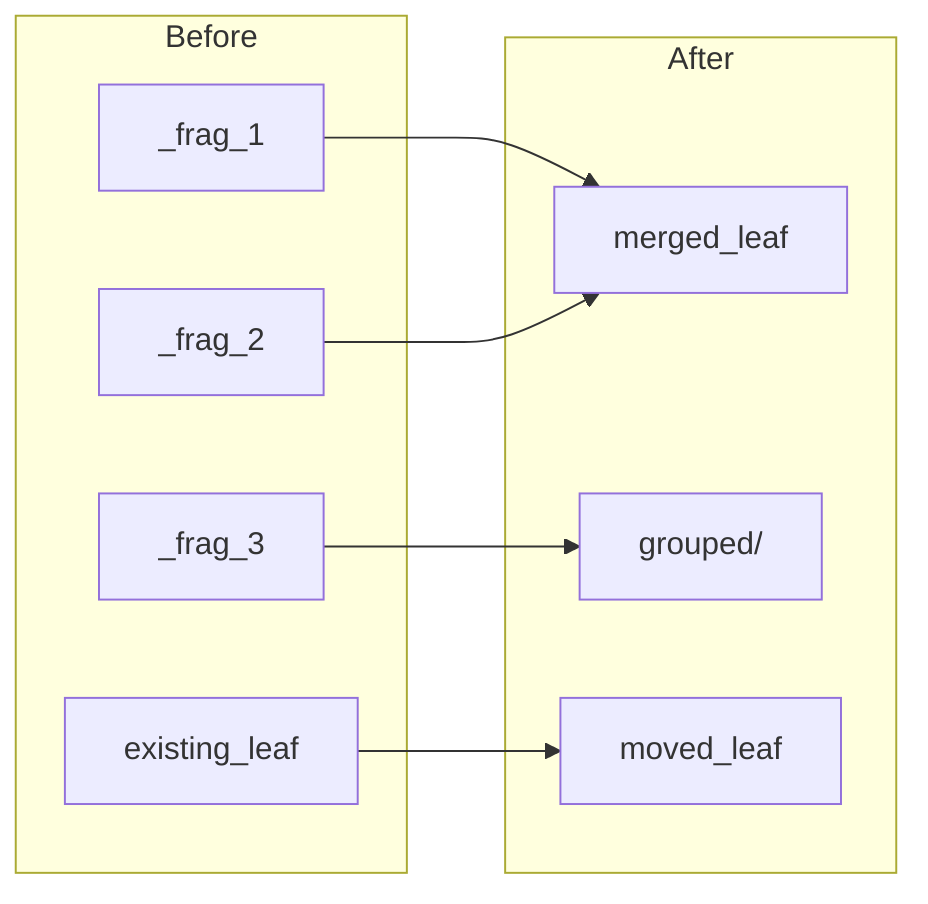
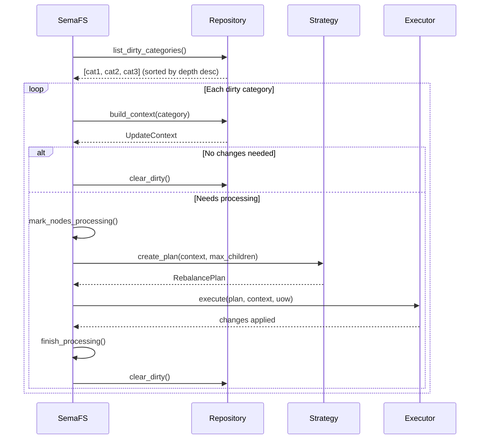
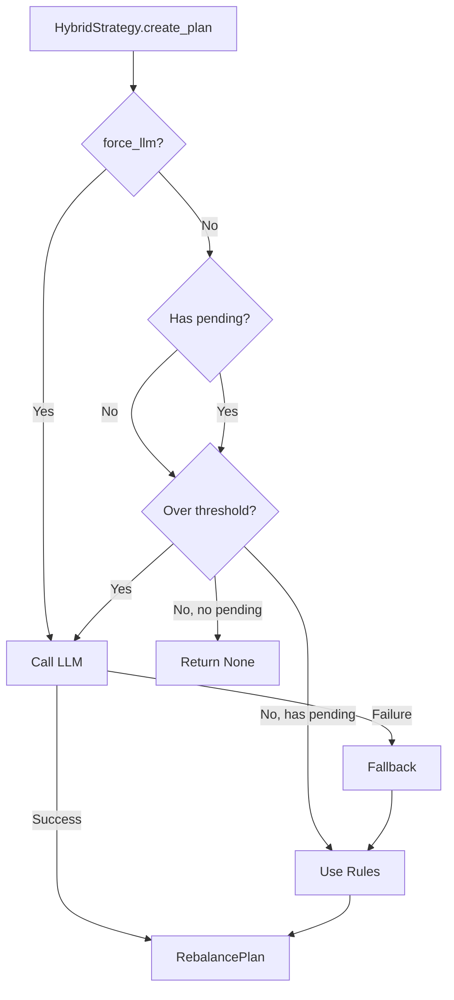
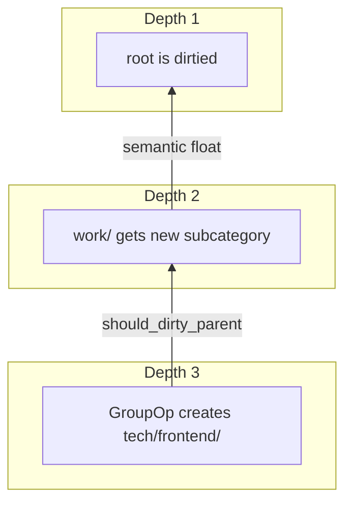
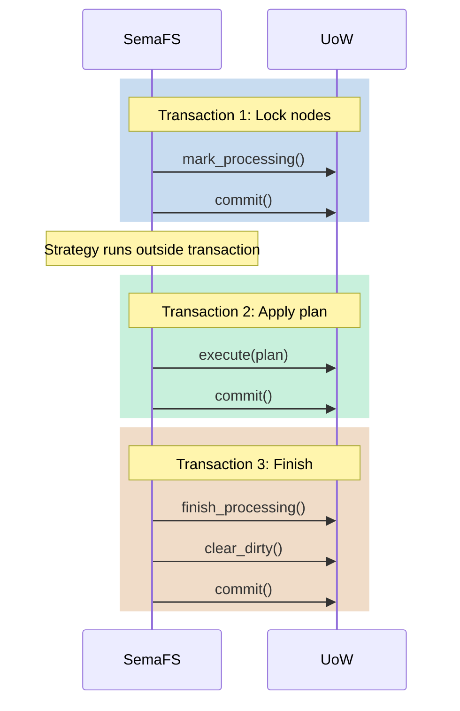

# Maintenance System

How SemaFS automatically organizes knowledge.

## Overview

Maintenance transforms a collection of fragments into a coherent knowledge structure:



## Maintenance Loop



## Context Capture

Before processing, a snapshot is captured:

```python
context = UpdateContext(
    parent=category,           # The dirty category
    active_nodes=(...),        # ACTIVE children
    pending_nodes=(...),       # PENDING_REVIEW fragments
    sibling_categories=(...),  # Parent's sibling categories
    ancestor_categories=(...)  # Ancestor chain (max 3)
)
```

### Parallel Fetch

```python
# Efficient: parallel queries
children, siblings, ancestors = await asyncio.gather(
    repo.list_children(path),
    repo.list_sibling_categories(path),
    repo.get_ancestor_categories(path, max_depth=3)
)
```

### Context Immutability

```python
@dataclass(frozen=True)  # Immutable
class UpdateContext:
    active_nodes: Tuple[TreeNode, ...]   # Frozen tuple
    pending_nodes: Tuple[TreeNode, ...]  # Frozen tuple
```

**Benefits**:
- No mid-execution changes
- Safe for concurrent access
- Consistent LLM prompts

## Strategy Decision



### Decision Matrix

| Pending? | Over Threshold? | force_llm? | Action |
|----------|-----------------|------------|--------|
| No | No | No | Skip (None) |
| Yes | No | No | Rules |
| No | Yes | No | LLM |
| Yes | Yes | No | LLM |
| Any | Any | Yes | LLM |

## Plan Execution

### Execution Order

Operations execute sequentially in tuple order:

```python
for op in plan.ops:
    if isinstance(op, MergeOp):
        await executor._do_merge(op, context, uow)
    elif isinstance(op, GroupOp):
        await executor._do_group(op, context, uow)
    elif isinstance(op, MoveOp):
        await executor._do_move(op, context, uow)
    elif isinstance(op, PersistOp):
        await executor._do_persist(op, context, uow)
```

### ID Resolution

```python
def resolve(node_id: str) -> Optional[TreeNode]:
    # Try full UUID
    if node_id in context_map:
        return context_map[node_id]

    # Try 8-char prefix (from LLM prompts)
    for full_id, node in context_map.items():
        if full_id.startswith(node_id[:8]):
            return node

    return None  # Invalid ID, skip
```

### Error Tolerance

| Error | Behavior |
|-------|----------|
| Invalid node ID | Skip operation, log warning |
| Node is CATEGORY (merge) | Skip that node |
| Target doesn't exist (move) | Skip operation |
| Insufficient nodes (merge/group) | Skip operation |

## Parent Updates

After operations, the parent category is updated:

```python
# Apply new content
parent.content = plan.updated_content

# Optional rename
if plan.updated_name:
    old_path = parent.path
    parent.name = plan.updated_name
    uow.register_cascade_rename(old_path, parent.path)
```

## Semantic Floating

When deep changes affect parent semantics:



### Trigger

```python
if plan.should_dirty_parent and context.parent.parent_path:
    grandparent = await repo.get_by_path(parent.parent_path)
    grandparent.request_semantic_rethink()  # _force_llm = True
    uow.register_dirty(grandparent)
```

### Effect

Next `maintain()` call:
1. Grandparent is in dirty list
2. `force_llm` flag triggers LLM analysis
3. Parent summary potentially rewritten

## Transaction Boundaries

### Multiple Transactions



**Why separate?**:
- LLM calls can be slow (don't hold locks)
- Each phase can fail independently
- Clear recovery points

## Error Recovery

### Per-Category Recovery

```python
async def _maintain_one(self, path: str) -> bool:
    try:
        # ... processing ...
        return True
    except Exception as e:
        logger.error(f"Failed {path}: {e}")
        await self._safe_rollback_processing(nodes)
        return False
```

### Status Restoration

```python
async def _safe_rollback_processing(self, nodes):
    for node in nodes:
        if node.status == NodeStatus.PROCESSING:
            node.fail_processing()  # Restore original
            uow.register_dirty(node)
    await uow.commit()
```

### Dirty Flag Persistence

Failed categories remain dirty:

```python
# Category fails maintenance
# is_dirty stays True
# Next maintain() will retry
```

## Performance Optimization

### Batch Processing

```python
# Write many fragments
for content in contents:
    await semafs.write("root.work", content)

# Single maintenance pass
await semafs.maintain()  # Processes once per category
```

### Threshold Tuning

```python
# Lower threshold = more LLM calls, better organization
strategy = HybridStrategy(adapter, max_nodes=5)

# Higher threshold = fewer calls, more basic organization
strategy = HybridStrategy(adapter, max_nodes=15)
```

### Parallel Context Fetch

```python
# Parallel database queries
children, siblings, ancestors = await asyncio.gather(
    repo.list_children(path),
    repo.list_sibling_categories(path),
    repo.get_ancestor_categories(path, max_depth=3)
)
```

## Monitoring

### Dirty Count

```python
stats = await semafs.stats()
print(f"Pending: {stats.dirty_categories}")
```

### Verbose Logging

```python
import logging
logging.getLogger("semafs").setLevel(logging.DEBUG)

await semafs.maintain()
# DEBUG: Processing root.work (depth=2)
# DEBUG: Context: 5 active, 3 pending
# DEBUG: Strategy: LLM plan with MERGE×1, GROUP×1
# DEBUG: Execution complete
```

## See Also

- [Architecture](/design/architecture) - System overview
- [Tree Operations](/guide/operations) - Operation details
- [Strategies](/guide/strategies) - Strategy configuration
