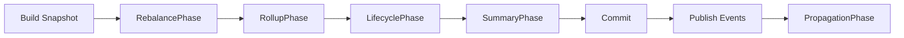
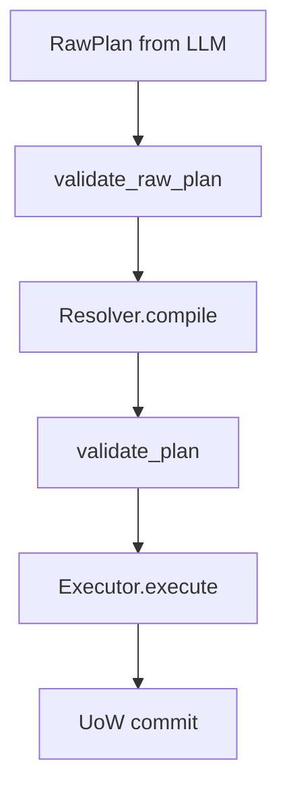

# Maintenance System

SemaFS 维护系统的目标是：在不牺牲写入可靠性的前提下，持续优化语义结构。

## Trigger Model

维护有两条入口：

1. 事件驱动：`write()` 后发布事件，由 `Pulse` 触发 `Keeper.reconcile`
2. 批处理驱动：`sweep(limit)` 扫描 overflow 分类并执行 reconcile

## Reconcile Pipeline

## Phase Responsibilities

### RebalancePhase

- `strategy.draft(snapshot)` 生成 RawPlan
- `PlanGuard` 做 raw/plan 双层校验
- `Resolver` 解析短 ID/目标路径为可执行 `Plan`
- `Executor` 将 `Plan` 翻译为 UoW staging 动作

### RollupPhase

- 在终端深度满足条件时触发
- 将一批历史叶子汇总为 rollup 叶子
- 原叶子转为 `cold`

### LifecyclePhase

- 将 `pending` 子节点晋升为 `active`
- 生成 `Persisted` 事件

### SummaryPhase

- 基于当前子节点重算分类摘要
- 更新 `category_meta` 与 `summary`

### PropagationPhase

- 根据策略信号判断是否向父级传播
- 形成局部到上层的渐进式语义更新

## Why Phase-based

- 降低单文件/单函数复杂度
- 每个阶段可以独立测试与回归
- 便于替换局部策略（例如 rollup 策略）

## Guarded Execution

维护执行采用“先验证、后落库”模型：

这意味着：LLM 输出不会直接触发数据变更。

## Concurrency Model

- `Keeper` 对单节点 reconcile 使用 lock 串行化
- SQLite 写事务使用 `BEGIN IMMEDIATE` 串行提交
- 快照读取优先通过 `uow.reader` 保持事务一致性

## Operability

每轮 reconcile 产出 `ReconcileMetrics`，包含：

- `rebalance_tried/rebalance_done`
- `promoted/rolled_up/summary_changed/propagated`
- `guard_rejects/guard_codes`

这为线上观测和回归分析提供统一维度。

## Failure Semantics

- 任一阶段异常会触发事务回滚（当前 UoW）
- 失败不会污染已提交状态
- 下轮 sweep/事件可继续重试，具备最终收敛能力
