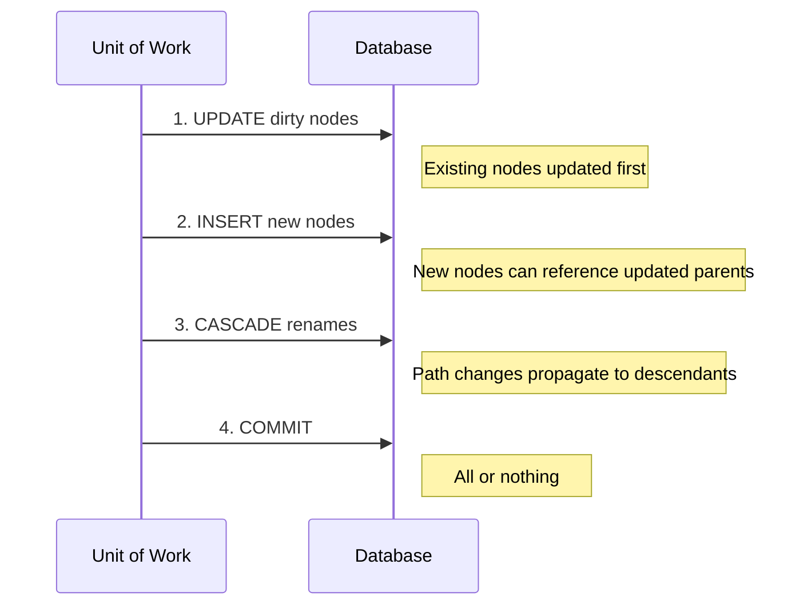
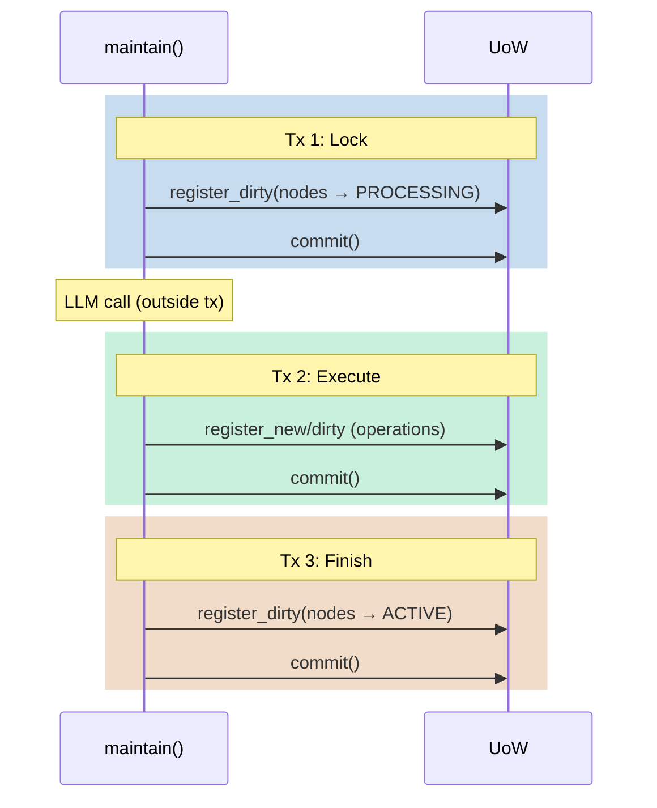
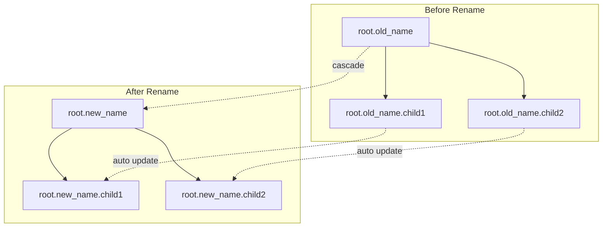

# Transaction Model

ACID guarantees and transaction management in SemaFS.

## Unit of Work Pattern

All changes are staged before commit:

```mermaid
graph LR
    subgraph "Staging Area"
        N[New Nodes]
        D[Dirty Nodes]
        R[Renames]
    end

    N & D & R --> C{commit()}
    C -->|Success| DB[(Database)]
    C -->|Failure| RB[rollback()]
```

## UnitOfWork API

```python
class UnitOfWork:
    def register_new(self, node: TreeNode) -> None:
        """Stage for INSERT."""

    def register_dirty(self, node: TreeNode) -> None:
        """Stage for UPDATE."""

    def register_cascade_rename(
        self, old_path: str, new_path: str
    ) -> None:
        """Stage path rename with descendants."""

    async def commit(self) -> None:
        """Persist all changes atomically."""

    async def rollback(self) -> None:
        """Discard all staged changes."""
```

## Commit Order

Changes apply in specific order for integrity:



### Why This Order?

1. **Updates before inserts**: New nodes may reference updated parents
2. **Inserts before cascades**: Cascade updates existing paths
3. **Atomic commit**: Either all succeed or none

## Transaction Boundaries

### Implicit Transactions

Most operations manage their own transactions:

```python
# write() internally:
async def write(self, path, content, payload):
    async with self.factory.begin() as uow:
        # ... create fragment ...
        uow.register_new(fragment)
        uow.register_dirty(parent)
        await uow.commit()
```

### Explicit Transactions

For custom multi-step operations:

```python
async with factory.begin() as uow:
    # All changes staged
    node1 = TreeNode.new_leaf(...)
    uow.register_new(node1)

    node2.content = "updated"
    uow.register_dirty(node2)

    # Single atomic commit
    await uow.commit()
```

### Maintenance Transactions

Maintenance uses multiple transactions:



**Rationale**:
- LLM calls shouldn't hold locks
- Each phase recoverable independently
- Clear transaction boundaries

## ACID Properties

### Atomicity

All changes in a UoW commit together or not at all:

```python
async with factory.begin() as uow:
    uow.register_new(node1)
    uow.register_new(node2)
    # If commit fails, neither is persisted
    await uow.commit()
```

### Consistency

Constraints enforced:

```sql
-- Unique non-archived paths
UNIQUE(parent_path, name) WHERE status != 'ARCHIVED'
```

If violated, transaction rolls back.

### Isolation

Context snapshots prevent interference:

```python
# Frozen context for maintenance
context = UpdateContext(
    active_nodes=tuple(...),   # Immutable
    pending_nodes=tuple(...)   # Immutable
)
# Other writes don't affect this maintenance
```

### Durability

SQLite WAL mode ensures persistence:

```python
# After commit(), changes survive crashes
await uow.commit()
```

## Error Handling

### Automatic Rollback

Context manager handles errors:

```python
async with factory.begin() as uow:
    uow.register_new(node)
    raise ValueError("Something wrong")
    # Automatic rollback on exception
```

### Manual Rollback

Explicit rollback when needed:

```python
uow = await factory.begin()
try:
    uow.register_new(node)
    if some_condition:
        await uow.rollback()
        return
    await uow.commit()
except Exception:
    await uow.rollback()
    raise
```

### Status Recovery

PROCESSING nodes restored on failure:

```python
# Before processing
node._original_status = node.status
node.status = PROCESSING

# On failure
node.status = node._original_status  # Restored
```

## Cascade Renames

When a category is renamed, descendants update:



### Implementation

```python
async def cascade_rename(self, old_path: str, new_path: str):
    # Update all nodes where parent_path starts with old_path
    await self.conn.execute("""
        UPDATE semafs_nodes
        SET parent_path = ? || substr(parent_path, ?)
        WHERE parent_path LIKE ? || '%'
    """, (new_path, len(old_path) + 1, old_path))
```

## Conflict Resolution

### Path Conflicts

When creating nodes, paths are made unique:

```python
def ensure_unique_path(parent_path, name):
    full_path = f"{parent_path}.{name}"
    if not path_exists(full_path):
        return name

    # Try numbered suffixes
    for i in range(1, 100):
        candidate = f"{name}_{i}"
        if not path_exists(f"{parent_path}.{candidate}"):
            return candidate

    raise ConflictError("Cannot find unique path")
```

### Batch Conflicts

Within a single execution, track used paths:

```python
class Executor:
    def execute(self, plan, context, uow):
        self._used_paths = set()  # Track this batch

        for op in plan.ops:
            path = self._resolve_path(...)
            self._used_paths.add(path)
```

## Best Practices

### 1. Short Transactions

```python
# Good: Quick commit
async with factory.begin() as uow:
    uow.register_dirty(node)
    await uow.commit()

# Bad: Long-running work in transaction
async with factory.begin() as uow:
    await slow_llm_call()  # Holds resources
    await uow.commit()
```

### 2. Explicit Boundaries

```python
# Clear about what's atomic
async with factory.begin() as uow:
    # These two changes are atomic
    uow.register_new(child)
    parent.child_count += 1
    uow.register_dirty(parent)
    await uow.commit()
```

### 3. Handle Failures

```python
try:
    await semafs.maintain()
except Exception as e:
    # Individual category failures are logged
    # but don't stop overall processing
    logger.error(f"Maintenance error: {e}")
```

## See Also

- [Architecture](/design/architecture) - System overview
- [Maintenance System](/design/maintenance) - Transaction usage
- [Repository API](/api/repository) - Storage interface
