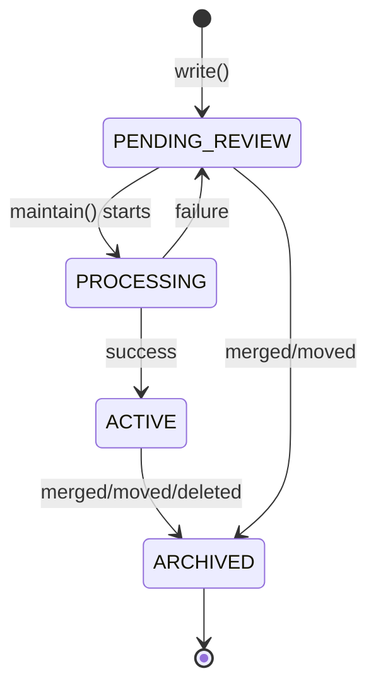
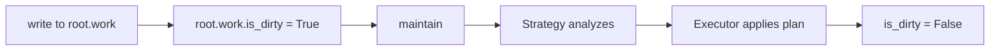

# Core Concepts

Understanding the fundamental building blocks of SemaFS.

::: warning API Migration Note
Some legacy method names in this page are being updated.
Canonical read/write/maintenance APIs are `write(...)`, `sweep(...)`, `tree(...)`, and `related(...)`.
See [SemaFS API](/api/semafs) for the latest signatures.
:::

## Node Types

Every piece of knowledge in SemaFS is stored as a **TreeNode**. There are two types:

### CATEGORY Nodes

**Purpose**: Organizational containers that group related knowledge.

```python
# Example CATEGORY node
{
    "path": "root.preferences.food",
    "type": "CATEGORY",
    "content": "Food preferences: enjoys coffee, Japanese cuisine...",  # Summary
    "is_dirty": False
}
```

- Contains child nodes (both CATEGORY and LEAF)
- `content` is a **summary** of all descendants
- `is_dirty` flag indicates pending maintenance

### LEAF Nodes

**Purpose**: Terminal nodes containing actual knowledge.

```python
# Example LEAF node
{
    "path": "root.preferences.food.coffee",
    "type": "LEAF",
    "content": "Dark roast, Ethiopian origin, no sugar, occasional oat milk",
    "is_dirty": False  # Always false for LEAFs
}
```

- Cannot have children (terminal)
- `content` is the **complete** knowledge
- Never marked dirty

## Path System

Paths are dot-separated identifiers that define hierarchy:

```
root                          # Root node (always exists)
root.work                     # Category under root
root.work.meetings            # Category under work
root.work.meetings.standup    # Leaf node
```

### NodePath Rules

- **Characters**: Only `[a-z0-9_.]` allowed
- **Case**: Automatically lowercased
- **Root**: Always starts with `root`
- **Depth**: Number of segments (root = 1)

```python
from semafs.core.node import NodePath

path = NodePath("root.work.meetings")
path.parent   # NodePath("root.work")
path.name     # "meetings"
path.depth    # 3
path.child("standup")  # NodePath("root.work.meetings.standup")
```

## Node Lifecycle

Nodes transition through well-defined states:



### Status Meanings

| Status | Visibility | Description |
|--------|------------|-------------|
| `PENDING_REVIEW` | Maintenance only | New fragment, awaiting organization |
| `PROCESSING` | Hidden | Currently being reorganized |
| `ACTIVE` | Full | Stable, queryable knowledge |
| `ARCHIVED` | Audit only | Superseded by merge/move operation |

## Information Hierarchy

**Core principle**: `Depth ∝ Specificity`

```
root (Depth 0)
├── "User profile: software engineer interested in..."  ← Global overview

├── food (Depth 1)
│   ├── "Dietary preferences: coffee lover, enjoys..."  ← Domain summary
│   │
│   ├── coffee (Depth 2)
│   │   ├── "Coffee preferences: dark roast, Ethiopian..." ← Topic details
│   │   │
│   │   └── brewing (Depth 3)
│   │       └── "V60 pour-over, 93°C, 1:15 ratio..."  ← Atomic facts
```

Each parent **summarizes** its children, creating a natural abstraction ladder.

## Views

When you read from SemaFS, you get **Views**—structured objects with context:

### NodeView

Single node with navigation context:

```python
view = await semafs.read("root.work")

view.path          # "root.work"
view.content       # "Work-related notes and tasks..."
view.breadcrumb    # ("root", "work")
view.child_count   # 5
view.sibling_count # 3
view.is_category   # True
```

### TreeView

Recursive tree structure:

```python
tree = await semafs.view_tree("root", max_depth=2)

tree.node          # Root TreeNode
tree.children      # Tuple of child TreeViews
tree.total_nodes   # 42
tree.leaf_count    # 28
tree.depth         # Current depth in tree
```

### RelatedNodes

Navigation map for exploration:

```python
related = await semafs.get_related("root.work")

related.parent     # Parent node
related.siblings   # Sibling nodes
related.children   # Child nodes
related.ancestors  # Path from root
```

## Fragments

When you `write()`, you create a **Fragment**—a special LEAF node:

```python
fragment_id = await semafs.write(
    path="root.work",
    content="Completed sprint planning",
    payload={"source": "meeting"}
)
```

Fragments have:
- Status: `PENDING_REVIEW`
- Name: `_frag_{random_hex}`
- Parent: Closest existing CATEGORY

During `maintain()`, fragments are:
- **Persisted** as regular LEAFs, or
- **Merged** with similar content, or
- **Grouped** into new categories

## Dirty Flag

The `is_dirty` flag on CATEGORY nodes triggers maintenance:



Maintenance processes categories **deepest-first** (leaf-to-root) to ensure changes propagate upward correctly.

## Next Steps

- [Writing Memories](./writing) - The write API in detail
- [Reading & Querying](./reading) - All read operations
- [Maintenance](./maintenance) - How reorganization works
