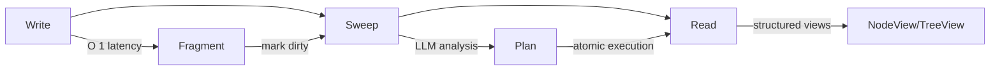

# Introduction

## What is SemaFS?

SemaFS (**Sema**ntic **F**ile**S**ystem) is a memory management system for Large Language Models that organizes knowledge fragments into a hierarchical tree structure—just like a filesystem.

Unlike traditional memory solutions (vector databases, key-value stores), SemaFS provides:

- **Hierarchical Organization**: Knowledge naturally decomposes into categories and subcategories
- **Automatic Maintenance**: LLM-powered reorganization keeps your knowledge base coherent
- **Structured Access**: Rich views with navigation context, not just raw data

For the latest value analysis and open-source benchmark:
[Value & Benchmark](./value-benchmark)

## Core Concept

```
Traditional Memory:           SemaFS Memory:
┌─────────────────┐           root/
│ key1 → value1   │           ├── preferences/
│ key2 → value2   │           │   ├── food/
│ key3 → value3   │   vs      │   │   ├── coffee
│ ...             │           │   │   └── cuisine
└─────────────────┘           │   └── work/
                              └── projects/
Flat, unstructured            Hierarchical, semantic
```

## The Write-Sweep-Read Cycle

SemaFS operates in three phases:



### 1. Write Phase
- Fast fragment insertion (O(1))
- Parent category marked as "dirty"
- Returns immediately with fragment ID

### 2. Sweep Phase
- Processes all dirty categories
- LLM creates reorganization plan
- Executor applies changes atomically
- Merge, Group, Move operations

### 3. Read Phase
- Returns structured views
- Navigation context included
- Hierarchical tree traversal

## Key Features

### Hierarchical Organization

The tree structure is **automatically organized**—categories and subcategories emerge from semantic clustering, not from predefined granularity. Depth levels are determined purely by how data gets grouped; there is no fixed mapping of "depth = granularity."

```
root/
├── preferences/          ← auto-grouped by semantics
│   ├── food/             ← subcategory emerges when needed
│   │   ├── coffee        ← depth depends on data organization
│   │   └── cuisine
│   └── work/
└── projects/
```

### Auto-Maintenance

The LLM analyzes your knowledge and decides:

- **MergeOp**: Combine semantically similar notes
- **GroupOp**: Create new categories for related items
- **MoveOp**: Relocate misclassified content

### Cost Optimization

```
Scenario                    → Action
────────────────────────────────────────
Under threshold + no new    → Skip (free)
Under threshold + new items → Rules (free)
Over threshold              → LLM (smart)
LLM failure                 → Fallback (safe)
```

## When to Use SemaFS

**Good fit:**
- Personal knowledge management
- LLM agent memory
- Team documentation
- Research organization
- Meeting notes aggregation

**Not ideal for:**
- Real-time streaming data
- Binary file storage
- Transactional workloads (use a real database)

## Next Steps

- [Value & Benchmark](./value-benchmark) - Latest assessment and open-source comparison
- [Quick Start](./quickstart) - Get up and running in 5 minutes
- [Core Concepts](./concepts) - Understand the data model
- [Design Philosophy](/design/philosophy) - Architecture mindset and trade-offs
- [Writing Memories](./writing) - Learn the write API
