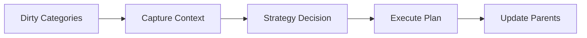
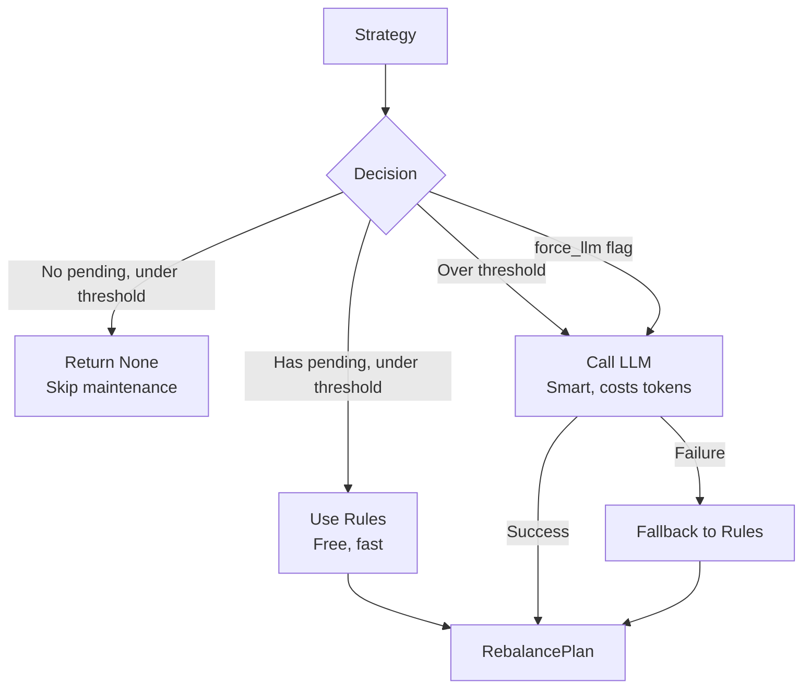
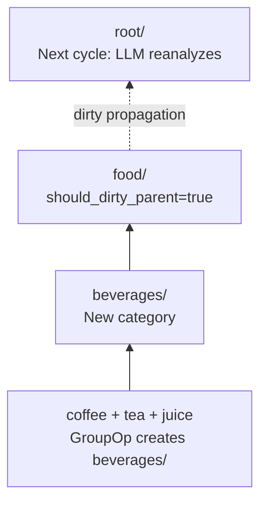
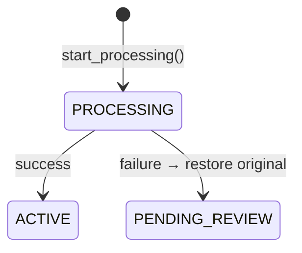

# Maintenance

Understanding SemaFS's automatic knowledge organization.

## Overview

Maintenance is the process of organizing pending fragments into a coherent knowledge structure. It runs in three steps:



## Running Maintenance

```python
# Process all dirty categories
processed_count = await semafs.maintain()
print(f"Organized {processed_count} categories")
```

### When to Run

**Manual trigger:**
```python
# After batch writes
for note in notes:
    await semafs.write("root.work", note)
await semafs.maintain()
```

**Periodic background:**
```python
import asyncio

async def maintenance_loop(semafs, interval=60):
    while True:
        await semafs.maintain()
        await asyncio.sleep(interval)
```

## Processing Order

Categories are processed **deepest-first** (leaf-to-root):

```
Tree:                    Processing Order:
root                     4. root
├── work                 2. work
│   └── meetings         1. meetings (deepest)
└── food                 3. food
```

This ensures child changes propagate to parents correctly.

## UpdateContext

Before processing, a snapshot is captured:

```python
@dataclass
class UpdateContext:
    parent: TreeNode              # Category being maintained
    active_nodes: Tuple[TreeNode] # ACTIVE children
    pending_nodes: Tuple[TreeNode] # PENDING_REVIEW fragments
    sibling_categories: Tuple[TreeNode]  # Naming context
    ancestor_categories: Tuple[TreeNode] # Hierarchy context
```

### Why Snapshots?

- **Consistency**: No mid-operation changes
- **Parallelism**: Multiple categories can process safely
- **Context**: LLM sees complete picture

## Strategy Decision

The strategy examines context and decides:



### Threshold Logic

```python
# Default: max_nodes = 8
# If category has ≤8 children → use rules (free)
# If category has >8 children → use LLM (smart)
```

### Forcing LLM

```python
# Via payload
await semafs.write("root.work", "content", {"_force_llm": True})

# Or programmatically
node.request_semantic_rethink()  # Sets internal _force_llm flag
```

## Plan Execution

The Executor applies operations atomically:

```python
class Executor:
    async def execute(
        self,
        plan: RebalancePlan,
        context: UpdateContext,
        uow: UnitOfWork
    ) -> None:
        for op in plan.ops:
            if isinstance(op, MergeOp):
                await self._do_merge(op, context, uow)
            elif isinstance(op, GroupOp):
                await self._do_group(op, context, uow)
            elif isinstance(op, MoveOp):
                await self._do_move(op, context, uow)
            elif isinstance(op, PersistOp):
                await self._do_persist(op, context, uow)

        # Apply parent updates
        self._apply_parent_updates(plan, context, uow)
```

### Execution Principles

1. **Zero SQL**: All changes via UnitOfWork
2. **Snapshot-based**: Uses context, not live reads
3. **Fault-tolerant**: Invalid IDs skipped gracefully
4. **Atomic**: All or nothing

## Semantic Floating

When deep changes affect parent semantics, they "float up":



### Trigger

```python
RebalancePlan(
    ops=[...],
    should_dirty_parent=True,  # ← Triggers floating
    ...
)
```

### Effect

```python
# In Executor, after applying plan:
if plan.should_dirty_parent:
    grandparent = await repo.get_by_path(parent.parent_path)
    grandparent.request_semantic_rethink()
    uow.register_dirty(grandparent)
```

## Error Handling

### Processing Failure

```python
async def _maintain_one(self, path: str) -> bool:
    try:
        # ... processing logic ...
        await uow.commit()
        return True
    except Exception as e:
        logger.error(f"Maintenance failed for {path}: {e}")
        await self._safe_rollback_processing(nodes)
        return False
```

### Status Recovery

If maintenance fails mid-processing:



Nodes save their original status and restore on failure.

### LLM Failure Fallback

```python
try:
    plan = await self.llm_adapter.call(context)
except LLMAdapterError:
    # Guaranteed fallback
    plan = self.create_fallback_plan(context)
```

## Monitoring Maintenance

### Check Dirty Categories

```python
stats = await semafs.stats()
print(f"Pending maintenance: {stats.dirty_categories} categories")
```

### Verbose Logging

```python
import logging
logging.getLogger("semafs").setLevel(logging.DEBUG)

# Now maintain() logs detailed info
await semafs.maintain()
```

Output:
```
DEBUG:semafs:Fetching dirty categories...
DEBUG:semafs:Processing root.work (depth=2)
DEBUG:semafs:Context: 3 active, 2 pending
DEBUG:semafs:Strategy returned: MERGE×1 | PERSIST×1
DEBUG:semafs:Executing plan...
DEBUG:semafs:Maintenance complete for root.work
```

## Best Practices

### 1. Batch Writes Before Maintain

```python
# Good: Single maintenance pass
for item in items:
    await semafs.write("root.work", item)
await semafs.maintain()  # Once

# Inefficient: Maintain after each write
for item in items:
    await semafs.write("root.work", item)
    await semafs.maintain()  # N times
```

### 2. Tune Thresholds

```python
# Low threshold = more LLM calls, better organization
strategy = HybridStrategy(adapter, max_nodes=5)

# High threshold = fewer LLM calls, less reorganization
strategy = HybridStrategy(adapter, max_nodes=15)
```

### 3. Handle Large Backlogs

```python
# If many categories are dirty, process in chunks
while True:
    processed = await semafs.maintain()
    if processed == 0:
        break
    print(f"Processed {processed}, checking for more...")
```

### 4. Monitor LLM Costs

```python
# Track LLM calls
class MonitoredAdapter(OpenAIAdapter):
    def __init__(self, *args, **kwargs):
        super().__init__(*args, **kwargs)
        self.call_count = 0

    async def _call_api(self, *args, **kwargs):
        self.call_count += 1
        return await super()._call_api(*args, **kwargs)
```

## Next Steps

- [Tree Operations](./operations) - Merge, Group, Move details
- [Strategies](./strategies) - Configure maintenance behavior
- [Transactions](./transactions) - Atomic operation guarantees
