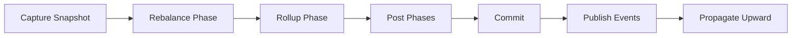

# Maintenance

How maintenance works in the latest SemaFS.

## Two Maintenance Paths

### 1) Event-driven reconcile (default)

After `write()`, SemaFS publishes a `Placed` event and reconciles the target category automatically.

### 2) Manual sweep

Use `sweep(limit)` to process categories that exceed budget thresholds.

```python
changed = await semafs.sweep(limit=20)
print("processed categories:", changed)
```

## What `sweep()` Actually Does

- Finds overloaded categories (by current `Budget` thresholds)
- Processes them deepest-first
- Runs rebalance/rollup/summary/propagation phases
- Returns number of processed categories

## Reconcile Pipeline



## Trigger Strategy

Use this rule of thumb:

- small/interactive writes: rely on event-driven reconcile
- backlog or large imports: call `sweep(limit=...)` periodically

## Budget Tuning

```python
from semafs.core.capacity import Budget

# lower threshold => more aggressive maintenance
budget = Budget(soft=4, hard=6)

# higher threshold => fewer maintenance rounds
budget = Budget(soft=12, hard=20)
```

## Safety Guarantees

- transaction-based apply via Unit of Work
- guarded plan parsing/validation before mutation
- per-node reconcile lock to avoid conflicting writes

## Current vs Old API

Use:

- `sweep(limit)`

Do not use old examples like:

- `maintain()`

## Next Steps

- [Strategies](./strategies) - LLM vs non-LLM organization behavior
- [Transactions](./transactions) - Atomic mutation model
- [Operations](./operations) - Merge/Group/Move semantics
