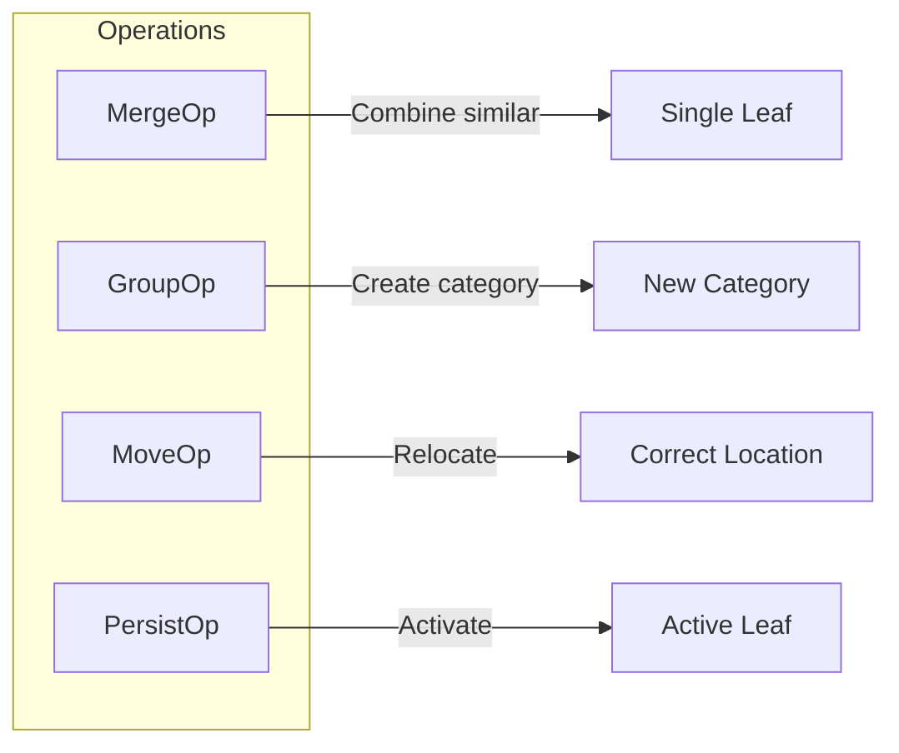
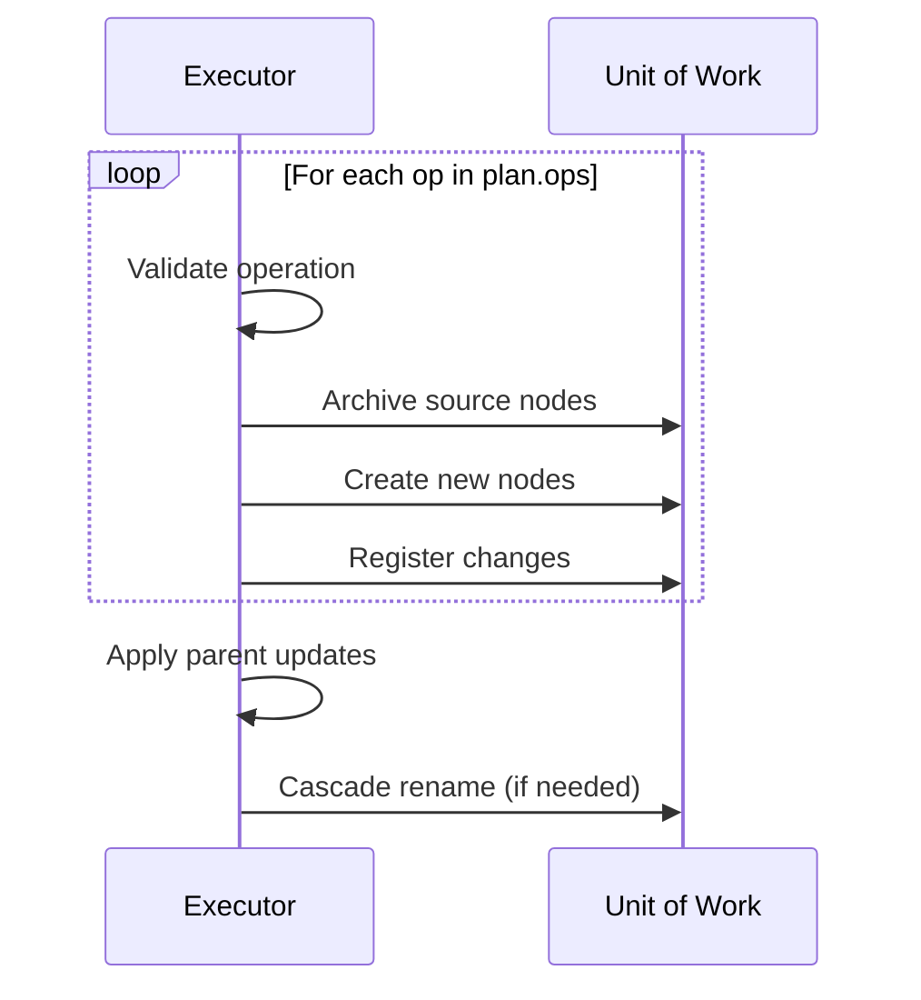

# Tree Operations

SemaFS uses four primitive operations to reorganize knowledge trees.

## Overview



## MergeOp

**Purpose**: Combine multiple semantically similar leaves into one.

### Before/After

```
Before:                              After:
parent/                              parent/
├── coffee_note_1: "dark roast"      └── coffee_preferences:
├── coffee_note_2: "Ethiopian"           "Dark roast, Ethiopian origin,
└── coffee_note_3: "no sugar"             no sugar, occasional oat milk"
```

### Formal Definition

```python
@dataclass(frozen=True)
class MergeOp:
    ids: FrozenSet[str]    # Node IDs to merge (≥2)
    content: str           # Synthesized content
    reasoning: str         # LLM's explanation
```

### Invariants

::: warning Lossless Merge
The merged content must preserve ALL specific information:
- Proper nouns (names, places, brands)
- Dates and times
- Numerical values
- Explicit preferences
:::

### Example

```python
# LLM creates this plan:
MergeOp(
    ids={"abc123", "def456", "ghi789"},
    content="Coffee preferences: dark roast, Ethiopian origin (discovered at Blue Bottle, March 2024), no sugar, occasionally adds oat milk",
    reasoning="All three notes are about coffee preferences and should be combined"
)
```

## GroupOp

**Purpose**: Create a new category and move related leaves into it.

### Before/After

```
Before:                              After:
root/                                root/
├── react_tips                       ├── tech/
├── vue_experience                   │   └── frontend/
├── typescript_notes                 │       ├── react_tips
└── coffee_preference                │       ├── vue_experience
                                     │       └── typescript_notes
                                     └── coffee_preference
```

### Formal Definition

```python
@dataclass(frozen=True)
class GroupOp:
    ids: FrozenSet[str]    # Node IDs to group (≥2)
    name: str              # New category name (dots create hierarchy)
    content: str           # Category summary
    reasoning: str
```

### Hierarchical Names

The `name` field supports dot notation for creating nested categories:

```python
# name="tech.frontend" creates:
# parent/
# └── tech/           ← Created if missing
#     └── frontend/   ← Group target
#         ├── node1
#         └── node2
```

### Example

```python
GroupOp(
    ids={"react123", "vue456", "ts789"},
    name="tech.frontend",
    content="Frontend development preferences and tips",
    reasoning="These are all frontend framework related notes"
)
```

## MoveOp

**Purpose**: Relocate a misclassified leaf to an existing category.

### Before/After

```
Before:                              After:
food/                                food/
├── coffee                           └── coffee
└── tea_wrong_place                 drinks/
drinks/                              ├── juice
└── juice                            └── tea  ← Moved here
```

### Formal Definition

```python
@dataclass(frozen=True)
class MoveOp:
    id: str              # Single node ID
    target_path: str     # Must be existing CATEGORY
    reasoning: str
```

### Safety Constraint

::: danger Target Must Exist
MoveOp can only move to **existing** categories. It cannot create new paths.

This prevents LLM hallucination from fabricating arbitrary paths.
:::

### Example

```python
MoveOp(
    id="tea123",
    target_path="root.drinks",
    reasoning="Tea belongs in drinks, not food"
)
```

## PersistOp

**Purpose**: Convert a pending fragment to an active leaf without transformation.

### Before/After

```
Before:                              After:
parent/                              parent/
└── _frag_abc123 (PENDING)           └── coffee_note (ACTIVE)
```

### Formal Definition

```python
@dataclass(frozen=True)
class PersistOp:
    id: str              # Fragment ID
    reasoning: str
```

### Usage

PersistOp is used by **rule-based strategies** when no semantic transformation is needed:

```python
PersistOp(
    id="frag_abc123",
    reasoning="Simple fragment, no merge candidates"
)
```

## RebalancePlan

Operations are bundled into a plan for atomic execution:

```python
@dataclass(frozen=True)
class RebalancePlan:
    ops: Tuple[Op, ...]           # Ordered operations
    updated_content: str          # New parent summary
    updated_name: Optional[str]   # Optional rename
    overall_reasoning: str        # Strategy explanation
    should_dirty_parent: bool     # Trigger semantic floating?
    is_llm_plan: bool            # LLM or rule-based?
```

### Example Plan

```python
RebalancePlan(
    ops=(
        MergeOp(ids={"a", "b"}, content="...", reasoning="..."),
        GroupOp(ids={"c", "d"}, name="tech", content="...", reasoning="..."),
    ),
    updated_content="Updated category summary after reorganization",
    updated_name=None,
    overall_reasoning="Merged similar notes and grouped tech content",
    should_dirty_parent=True,
    is_llm_plan=True
)
```

## Execution Order

Operations execute **sequentially** in tuple order:



## ID Resolution

The Executor supports both full UUIDs and 8-character short IDs:

```python
# LLM might return short IDs from prompts:
MergeOp(ids={"abc12345", "def67890"}, ...)

# Executor resolves both formats:
def _resolve(node_id: str) -> Optional[TreeNode]:
    # Try full UUID
    if node_id in context_map:
        return context_map[node_id]
    # Try 8-char prefix
    for full_id, node in context_map.items():
        if full_id.startswith(node_id[:8]):
            return node
    return None  # Invalid ID, skip gracefully
```

## Error Handling

Invalid operations are **skipped gracefully**:

| Error | Behavior |
|-------|----------|
| Invalid node ID | Skip operation, log warning |
| Node is CATEGORY (for Merge) | Skip that node |
| Target path doesn't exist (Move) | Skip operation |
| Less than 2 nodes (Merge/Group) | Skip operation |

This tolerance prevents LLM hallucinations from crashing the system.

## Next Steps

- [Strategies](./strategies) - How operations are decided
- [Transactions](./transactions) - Atomic execution guarantees
- [Architecture](/design/architecture) - System design deep dive
