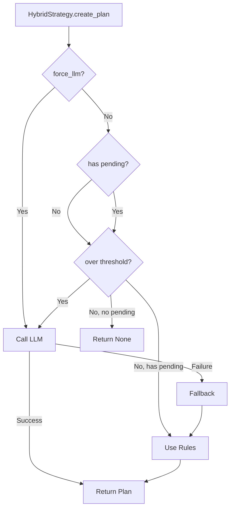

# Strategies

Configure how SemaFS organizes your knowledge.

## Overview

A **Strategy** decides how to reorganize a category during maintenance:

```python
class Strategy(Protocol):
    async def create_plan(
        self,
        context: UpdateContext,
        max_children: int
    ) -> Optional[RebalancePlan]: ...

    def create_fallback_plan(
        self,
        context: UpdateContext,
        max_children: int
    ) -> RebalancePlan: ...
```

SemaFS ships with two strategies:

| Strategy | LLM Required | Best For |
|----------|--------------|----------|
| `RuleOnlyStrategy` | No | Testing, simple use cases |
| `HybridStrategy` | Yes | Production, smart organization |

## RuleOnlyStrategy

Deterministic, rule-based organization with no LLM calls.

### Usage

```python
from semafs.strategies.rule import RuleOnlyStrategy

strategy = RuleOnlyStrategy()
semafs = SemaFS(factory, strategy)
```

### Behavior

1. **Persist** all pending fragments as ACTIVE leaves
2. **Auto-group** if over capacity (simple batching)
3. **Update** parent content by appending

```python
# Example: 3 fragments with max_children=8
# Result: 3 PersistOp operations
# Parent content: "{old}\n[New records]\n{fragment1}\n{fragment2}\n{fragment3}"
```

### When to Use

- Development and testing (no API costs)
- Simple knowledge bases
- Guaranteed fast execution
- LLM fallback

## HybridStrategy

Intelligent organization using LLM, with rule-based fallback.

### Usage

```python
from openai import AsyncOpenAI
from semafs.infra.llm.openai import OpenAIAdapter
from semafs.strategies.hybrid import HybridStrategy

client = AsyncOpenAI()
adapter = OpenAIAdapter(client, model="gpt-4o-mini")

strategy = HybridStrategy(
    llm_adapter=adapter,
    max_nodes=8,           # Trigger LLM above this
    rule_fallback=None     # Auto-creates RuleOnlyStrategy
)

semafs = SemaFS(factory, strategy)
```

### Decision Logic



### Configuration

```python
HybridStrategy(
    llm_adapter=adapter,     # Required: LLM connection
    max_nodes=8,             # Default: 8, trigger threshold
    rule_fallback=None       # Optional: custom fallback strategy
)
```

### Threshold Tuning

| max_nodes | LLM Calls | Organization Quality |
|-----------|-----------|---------------------|
| 3-5 | Frequent | High (more merging/grouping) |
| 8-10 | Moderate | Balanced |
| 15+ | Rare | Lower (less reorganization) |

## LLM Adapters

### OpenAI

```python
from openai import AsyncOpenAI
from semafs.infra.llm.openai import OpenAIAdapter

client = AsyncOpenAI()  # Uses OPENAI_API_KEY
adapter = OpenAIAdapter(
    client=client,
    model="gpt-4o-mini",    # Cost-effective
    # model="gpt-4o",       # Higher quality
    temperature=0.7
)
```

### Anthropic

```python
from anthropic import AsyncAnthropic
from semafs.infra.llm.anthropic import AnthropicAdapter

client = AsyncAnthropic()  # Uses ANTHROPIC_API_KEY
adapter = AnthropicAdapter(
    client=client,
    model="claude-3-haiku-20240307"  # Fast and cheap
)
```

## Custom Strategy

Implement the Strategy protocol for custom behavior:

```python
from semafs.ports.strategy import Strategy
from semafs.core.ops import RebalancePlan, PersistOp

class MyStrategy(Strategy):
    async def create_plan(
        self,
        context: UpdateContext,
        max_children: int
    ) -> Optional[RebalancePlan]:
        # Custom logic here
        if not context.pending_nodes:
            return None

        # Example: Always persist, never merge
        ops = tuple(
            PersistOp(id=node.id, reasoning="Custom persist")
            for node in context.pending_nodes
        )

        return RebalancePlan(
            ops=ops,
            updated_content=context.parent.content,
            is_llm_plan=False
        )

    def create_fallback_plan(
        self,
        context: UpdateContext,
        max_children: int
    ) -> RebalancePlan:
        # Must always return a valid plan
        return self.create_plan(context, max_children) or RebalancePlan(
            ops=(),
            updated_content=context.parent.content,
            is_llm_plan=False
        )
```

## Strategy Selection

Choose based on your needs:

```python
# Development: Fast, no API costs
strategy = RuleOnlyStrategy()

# Production: Smart organization
strategy = HybridStrategy(adapter, max_nodes=8)

# High-volume: Conservative LLM usage
strategy = HybridStrategy(adapter, max_nodes=15)

# Quality-focused: Aggressive organization
strategy = HybridStrategy(adapter, max_nodes=5)
```

## Monitoring Strategy Decisions

Enable debug logging:

```python
import logging
logging.getLogger("semafs.strategies").setLevel(logging.DEBUG)
```

Output:
```
DEBUG:semafs.strategies.hybrid:Context: 5 active, 3 pending, force_llm=False
DEBUG:semafs.strategies.hybrid:Decision: Under threshold (8), using rules
DEBUG:semafs.strategies.hybrid:Plan: PERSIST×3
```

## Cost Estimation

Rough token usage per LLM call:

| Component | Tokens |
|-----------|--------|
| System prompt | ~500 |
| Context (per node) | ~50-100 |
| Response | ~200-500 |

Example: Category with 10 nodes ≈ 1,500-2,000 tokens per call.

## Next Steps

- [LLM Integration](./llm-integration) - Provider setup details
- [Transactions](./transactions) - Atomic execution
- [Maintenance](./maintenance) - How strategies are invoked
