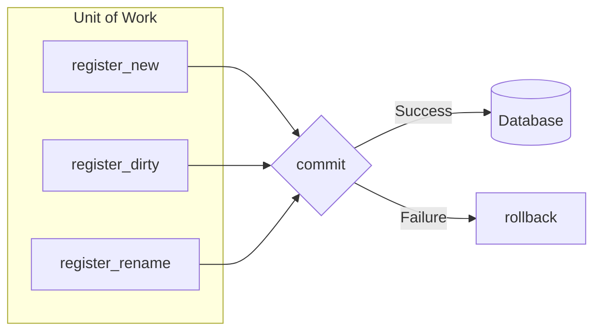
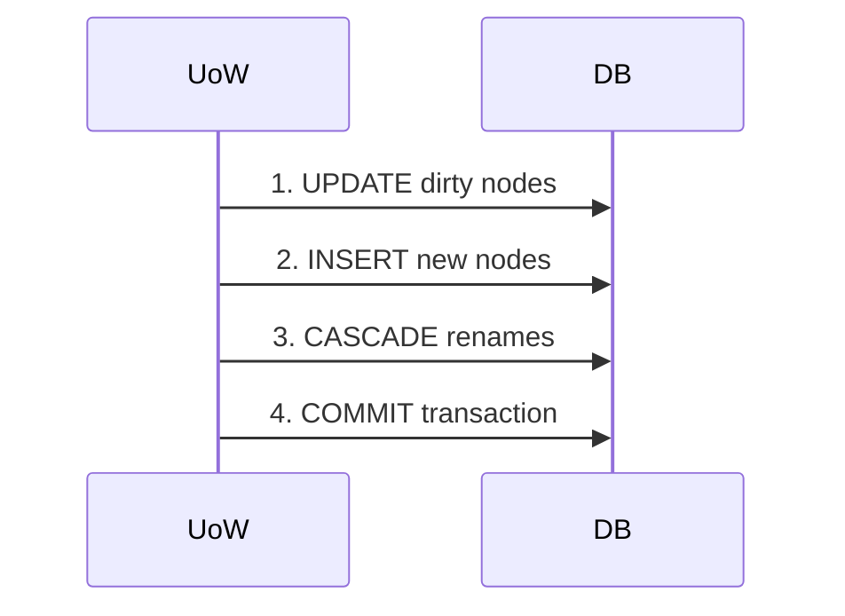

# Transactions

Understanding SemaFS's atomic operation guarantees.

## Overview

SemaFS uses the **Unit of Work** pattern to ensure atomic operations:



All changes are staged in memory and applied atomically on commit.

## Basic Usage

### Implicit Transactions

Most SemaFS operations handle transactions internally:

```python
# write() manages its own transaction
await semafs.write("root.work", "content")

# maintain() manages transactions per category
await semafs.maintain()
```

### Explicit Transactions

For custom operations, use the factory:

```python
async with factory.begin() as uow:
    # All changes in this block are atomic
    node = TreeNode.new_leaf(
        parent_path="root.work",
        name="custom_note",
        content="My content"
    )
    uow.register_new(node)

    # Modify existing node
    existing.content = "Updated"
    uow.register_dirty(existing)

    # Commits automatically on exit
# If exception occurs, auto-rollback
```

## Unit of Work API

### register_new(node)

Stage a new node for INSERT:

```python
uow.register_new(node)
```

### register_dirty(node)

Stage a modified node for UPDATE:

```python
node.content = "New content"
uow.register_dirty(node)
```

### register_cascade_rename(old_path, new_path)

Stage a path rename with cascade:

```python
# Renames node and all descendants
uow.register_cascade_rename("root.old_name", "root.new_name")
```

### commit()

Persist all staged changes:

```python
await uow.commit()
```

### rollback()

Discard all staged changes:

```python
await uow.rollback()
```

## Commit Order

The UoW commits changes in a specific order:



This order ensures:
- Updates complete before inserts reference them
- New nodes exist before cascades affect them
- All changes are atomic

## Error Handling

### Automatic Rollback

```python
async with factory.begin() as uow:
    uow.register_new(node1)
    uow.register_new(node2)
    raise ValueError("Something went wrong")
    # node1 and node2 are NOT committed
```

### Manual Rollback

```python
uow = await factory.begin()
try:
    uow.register_new(node)
    if some_condition:
        await uow.rollback()
        return
    await uow.commit()
except Exception:
    await uow.rollback()
    raise
```

## Transaction Isolation

### Read-Your-Writes

Changes are visible within the same UoW:

```python
async with factory.begin() as uow:
    node = TreeNode.new_leaf(...)
    uow.register_new(node)

    # Node is staged but not yet in DB
    # Other transactions won't see it yet
```

### Snapshot Isolation

Maintenance uses context snapshots:

```python
# UpdateContext captures state at start
context = UpdateContext(
    parent=category,
    active_nodes=active,    # Frozen tuple
    pending_nodes=pending   # Frozen tuple
)

# Changes during execution don't affect context
# Prevents phantom reads
```

## Maintenance Transactions

Each category is processed with its own transaction:

```python
async def _maintain_one(self, path: str) -> bool:
    # Transaction 1: Mark as PROCESSING
    async with factory.begin() as uow:
        for node in context.all_nodes:
            node.start_processing()
            uow.register_dirty(node)
        await uow.commit()

    # Strategy runs OUTSIDE transaction (LLM can be slow)
    plan = await strategy.create_plan(context, max_children)

    # Transaction 2: Apply plan
    async with factory.begin() as uow:
        await executor.execute(plan, context, uow)
        await uow.commit()

    # Transaction 3: Finish processing
    async with factory.begin() as uow:
        for node in processed_nodes:
            node.finish_processing()
            uow.register_dirty(node)
        await uow.commit()
```

### Why Multiple Transactions?

1. **PROCESSING lock**: Prevents concurrent modification
2. **Isolation**: LLM call is outside transaction (no long locks)
3. **Recovery**: Each phase can fail and recover independently

## Recovery Patterns

### Processing State Recovery

```python
if maintenance_fails:
    # Restore original status
    for node in processing_nodes:
        node.fail_processing()  # PROCESSING → original status
        uow.register_dirty(node)
    await uow.commit()
```

### Dirty Flag Preservation

```python
# Failed categories stay dirty
# Next maintain() will retry
category.is_dirty = True  # Preserved on failure
```

## Database Constraints

### Unique Path Constraint

```sql
CREATE UNIQUE INDEX idx_unique_path
    ON semafs_nodes(parent_path, name)
    WHERE status != 'ARCHIVED';
```

- Non-archived nodes must have unique paths
- Archived nodes can have duplicate paths (audit trail)
- Executor checks for conflicts before creating nodes

### Handling Conflicts

```python
# Executor resolves path conflicts
def _resolve_leaf_path(parent_path, name, uow):
    if path_exists(full_path):
        # Try numbered suffix
        for i in range(1, 100):
            candidate = f"{name}_{i}"
            if not path_exists(parent / candidate):
                return candidate
    return name
```

## Best Practices

### 1. Keep Transactions Short

```python
# Good: Minimal work in transaction
async with factory.begin() as uow:
    uow.register_dirty(node)
    await uow.commit()

# Bad: Long-running work in transaction
async with factory.begin() as uow:
    await slow_llm_call()  # Holds lock
    uow.register_dirty(node)
    await uow.commit()
```

### 2. Use Explicit Transactions for Multi-Step

```python
# Multiple related changes should be atomic
async with factory.begin() as uow:
    parent.content = "Updated"
    uow.register_dirty(parent)

    child = TreeNode.new_leaf(...)
    uow.register_new(child)

    # Both or neither
    await uow.commit()
```

### 3. Handle Failures Gracefully

```python
try:
    async with factory.begin() as uow:
        # Operations
        await uow.commit()
except Exception as e:
    logger.error(f"Transaction failed: {e}")
    # Auto-rollback already happened
    # Handle recovery logic
```

## Next Steps

- [Architecture](/design/architecture) - System design overview
- [Maintenance](./maintenance) - How transactions are used
- [API Reference](/api/repository) - Repository protocol
