# SemaFS

## 语义感知的层次化记忆文件系统

<div class="pt-12">
  <span class="px-2 py-1 rounded cursor-pointer" hover="bg-white bg-opacity-10">
    Semantic Filesystem for Large Language Models
  </span>
</div>

<div class="abs-br m-6 flex gap-2">
  <a href="https://github.com/your-repo/semafs" target="_blank" alt="GitHub"
    class="text-xl slidev-icon-btn opacity-50 !border-none !hover:text-white">
    <carbon-logo-github />
  </a>
</div>

---
layout: center
class: text-center
---

# 问题：LLM的记忆困境

<v-clicks>

## 🧠 LLM是无状态的

每次对话都从零开始，无法记住用户偏好

## 📦 现有方案的局限

| 方案 | 问题 |
|-----|------|
| Context Stuffing | 受限于上下文窗口 |
| Vector DB | 缺乏结构化组织 |
| Key-Value Store | 无层次关系 |
| Graph DB | 查询开销高 |

## 💡 核心洞察

**人类知识的组织方式 ≈ 文件系统的层次结构**

</v-clicks>

---
layout: two-cols
---

# 核心思想

<v-clicks>

### 记忆即文件系统

将知识碎片组织为树状结构

### 文件系统映射

| 文件系统 | SemaFS |
|---------|--------|
| 目录 | CATEGORY |
| 文件 | LEAF |
| 路径 | NodePath |
| 挂载点 | root |

### 自动维护

LLM驱动的语义重组织

</v-clicks>

::right::

<div class="ml-4">

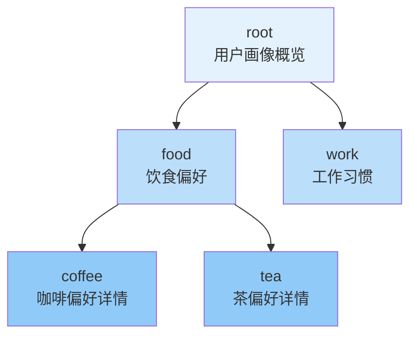
```mermaid {scale: 0.7}
graph TD
    R[root<br/>用户画像概览]
    F[food<br/>饮食偏好]
    W[work<br/>工作习惯]
    C[coffee<br/>咖啡偏好详情]
    T[tea<br/>茶偏好详情]

    R --> F
    R --> W
    F --> C
    F --> T

    style R fill:#e3f2fd
    style F fill:#bbdefb
    style W fill:#bbdefb
    style C fill:#90caf9
    style T fill:#90caf9
```

<div class="text-sm mt-4 text-gray-400">
深度越深，信息越精确
</div>

</div>

---
layout: center
---

# 系统架构

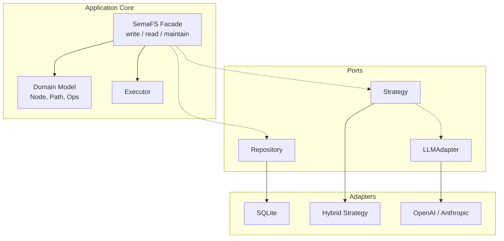
```mermaid {scale: 0.8}
graph TB
    subgraph "Application Core"
        DM[Domain Model<br/>Node, Path, Ops]
        SF[SemaFS Facade<br/>write / read / maintain]
        EX[Executor]
    end

    subgraph "Ports"
        PR[Repository]
        PS[Strategy]
        PL[LLMAdapter]
    end

    subgraph "Adapters"
        AR[SQLite]
        AS[Hybrid Strategy]
        AL[OpenAI / Anthropic]
    end

    SF --> DM
    SF --> EX
    SF -.-> PR & PS
    PS -.-> PL
    PR --> AR
    PS --> AS
    PL --> AL
```

<div class="text-center text-sm text-gray-400 mt-4">
六边形架构：核心逻辑与基础设施解耦
</div>

---

# Write-Maintain 双阶段循环

<div class="grid grid-cols-2 gap-8">

<div>

### Phase 1: Write（低延迟）

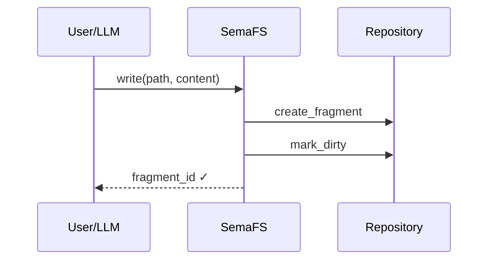
```mermaid {scale: 0.65}
sequenceDiagram
    participant U as User/LLM
    participant S as SemaFS
    participant R as Repository

    U->>S: write(path, content)
    S->>R: create_fragment
    S->>R: mark_dirty
    S-->>U: fragment_id ✓
```

<v-click>

- O(1) 路径解析
- 立即返回
- 标记父节点为 dirty

</v-click>

</div>

<div>

### Phase 2: Maintain（批量处理）

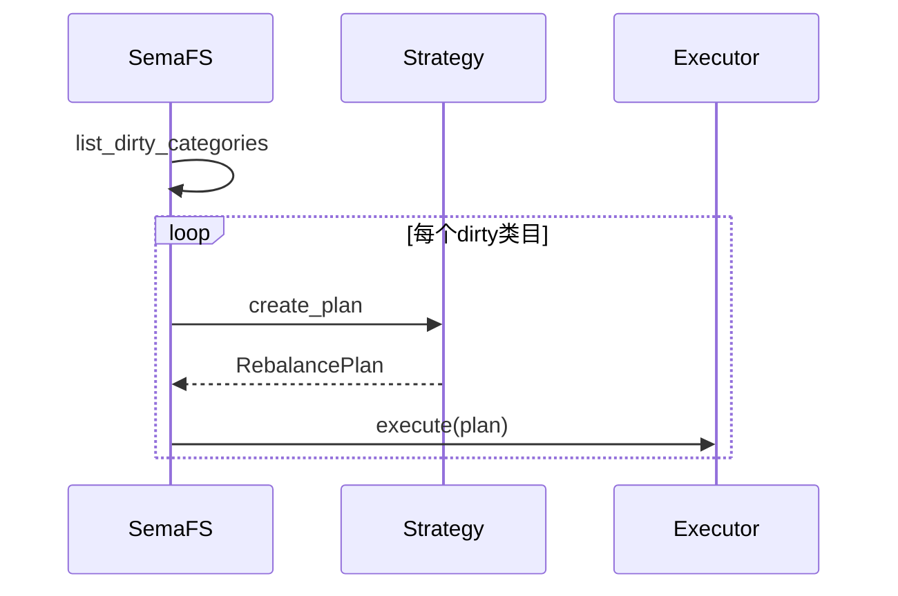
```mermaid {scale: 0.65}
sequenceDiagram
    participant S as SemaFS
    participant St as Strategy
    participant E as Executor

    S->>S: list_dirty_categories
    loop 每个dirty类目
        S->>St: create_plan
        St-->>S: RebalancePlan
        S->>E: execute(plan)
    end
```

<v-click>

- 深度优先处理
- LLM语义分析
- 批量摊销成本

</v-click>

</div>

</div>

---
layout: two-cols
---

# 数据模型：双节点类型

<v-clicks>

## CATEGORY 节点

- **功能**：组织容器
- **content**：子节点摘要
- **is_dirty**：需要维护？
- 可包含子节点

## LEAF 节点

- **功能**：知识原子单元
- **content**：完整内容
- **终端性**：不可再分层

</v-clicks>

::right::

<div class="ml-8 mt-8">

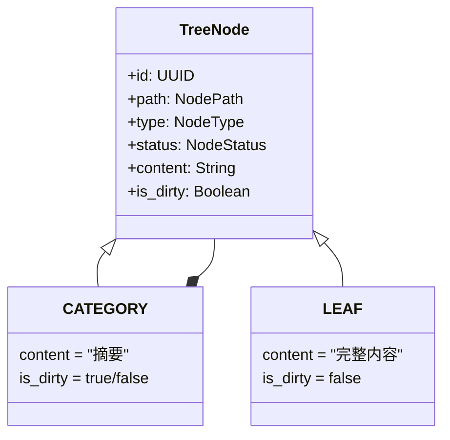
```mermaid {scale: 0.75}
classDiagram
    class TreeNode {
        +id: UUID
        +path: NodePath
        +type: NodeType
        +status: NodeStatus
        +content: String
        +is_dirty: Boolean
    }

    class CATEGORY {
        content = "摘要"
        is_dirty = true/false
    }

    class LEAF {
        content = "完整内容"
        is_dirty = false
    }

    TreeNode <|-- CATEGORY
    TreeNode <|-- LEAF
    CATEGORY *-- TreeNode
```

</div>

---

# 信息精确度梯度

<div class="text-center text-2xl mb-8">

**Depth ∝ Specificity**

</div>

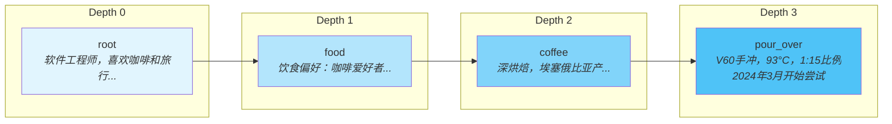
```mermaid {scale: 0.85}
graph LR
    subgraph "Depth 0"
        R[root<br/><i>软件工程师，喜欢咖啡和旅行...</i>]
    end

    subgraph "Depth 1"
        F[food<br/><i>饮食偏好：咖啡爱好者...</i>]
    end

    subgraph "Depth 2"
        C[coffee<br/><i>深烘焙，埃塞俄比亚产...</i>]
    end

    subgraph "Depth 3"
        P[pour_over<br/><i>V60手冲，93°C，1:15比例<br/>2024年3月开始尝试</i>]
    end

    R --> F --> C --> P

    style R fill:#e1f5fe
    style F fill:#b3e5fc
    style C fill:#81d4fa
    style P fill:#4fc3f7
```

<div class="grid grid-cols-4 gap-4 mt-6 text-sm text-center">
  <div class="bg-blue-50 p-2 rounded">全局概览</div>
  <div class="bg-blue-100 p-2 rounded">领域摘要</div>
  <div class="bg-blue-200 p-2 rounded">主题详情</div>
  <div class="bg-blue-300 p-2 rounded">原子事实</div>
</div>

---

# 节点生命周期

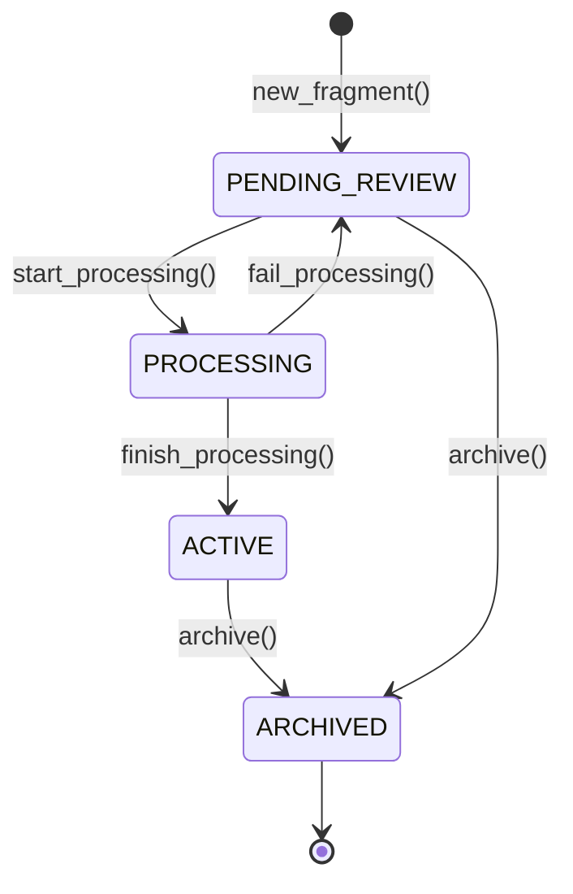
```mermaid {scale: 0.9}
stateDiagram-v2
    [*] --> PENDING_REVIEW: new_fragment()

    PENDING_REVIEW --> PROCESSING: start_processing()
    PROCESSING --> ACTIVE: finish_processing()
    PROCESSING --> PENDING_REVIEW: fail_processing()

    ACTIVE --> ARCHIVED: archive()
    PENDING_REVIEW --> ARCHIVED: archive()

    ARCHIVED --> [*]
```

<div class="grid grid-cols-4 gap-4 mt-8 text-sm">
  <div class="bg-yellow-100 p-3 rounded">
    <div class="font-bold">PENDING_REVIEW</div>
    新写入，等待处理
  </div>
  <div class="bg-orange-100 p-3 rounded">
    <div class="font-bold">PROCESSING</div>
    LLM处理中，锁定
  </div>
  <div class="bg-green-100 p-3 rounded">
    <div class="font-bold">ACTIVE</div>
    稳定，可查询
  </div>
  <div class="bg-gray-100 p-3 rounded">
    <div class="font-bold">ARCHIVED</div>
    已归档，审计用
  </div>
</div>

---
layout: center
class: text-center
---

# 树上操作

<div class="grid grid-cols-4 gap-6 mt-8">

<div class="bg-purple-50 p-4 rounded-lg">
  <div class="text-3xl mb-2">🔗</div>
  <div class="font-bold text-purple-700">MergeOp</div>
  <div class="text-sm text-gray-600">合并相似节点</div>
</div>

<div class="bg-blue-50 p-4 rounded-lg">
  <div class="text-3xl mb-2">📁</div>
  <div class="font-bold text-blue-700">GroupOp</div>
  <div class="text-sm text-gray-600">创建新分组</div>
</div>

<div class="bg-green-50 p-4 rounded-lg">
  <div class="text-3xl mb-2">➡️</div>
  <div class="font-bold text-green-700">MoveOp</div>
  <div class="text-sm text-gray-600">移动到正确位置</div>
</div>

<div class="bg-orange-50 p-4 rounded-lg">
  <div class="text-3xl mb-2">✅</div>
  <div class="font-bold text-orange-700">PersistOp</div>
  <div class="text-sm text-gray-600">简单激活</div>
</div>

</div>

---

# MergeOp：语义合并

<div class="grid grid-cols-2 gap-8">

<div>

### 定义

```typescript
MergeOp {
    ids: Set<NodeId>    // ≥2 个节点
    content: String     // 合成内容
    reasoning: String   // 解释
}
```

<v-click>

### 不变量

- 合并必须**无损**
- 保留所有具体数值
- 保留日期、专有名词

</v-click>

</div>

<div>

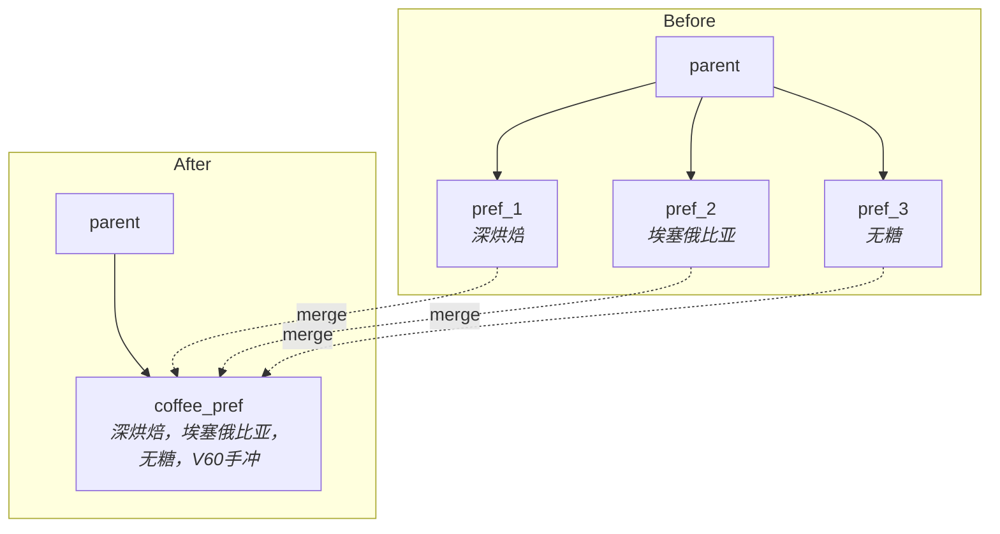
```mermaid {scale: 0.7}
graph TB
    subgraph Before
        P1[parent]
        L1[pref_1<br/><i>深烘焙</i>]
        L2[pref_2<br/><i>埃塞俄比亚</i>]
        L3[pref_3<br/><i>无糖</i>]
        P1 --> L1 & L2 & L3
    end

    subgraph After
        P2[parent]
        LM[coffee_pref<br/><i>深烘焙，埃塞俄比亚，<br/>无糖，V60手冲</i>]
        P2 --> LM
    end

    L1 & L2 & L3 -.->|merge| LM
```

</div>

</div>

---

# GroupOp：层次化分组

<div class="grid grid-cols-2 gap-8">

<div>

### 定义

```typescript
GroupOp {
    ids: Set<NodeId>    // ≥2 个节点
    name: String        // 支持点号层级
    content: String     // 分组摘要
}
```

<v-click>

### 特性

- 点号自动创建层级
- `tech.frontend` → 两级目录
- 原节点被 Archive
- 在新位置重建

</v-click>

</div>

<div>

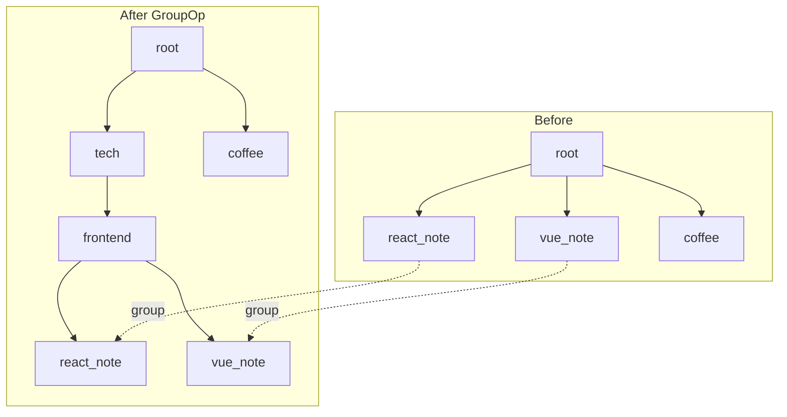
```mermaid {scale: 0.65}
graph TB
    subgraph "Before"
        R1[root]
        A[react_note]
        B[vue_note]
        C[coffee]
        R1 --> A & B & C
    end

    subgraph "After GroupOp"
        R2[root]
        T[tech]
        F[frontend]
        A2[react_note]
        B2[vue_note]
        C2[coffee]
        R2 --> T & C2
        T --> F
        F --> A2 & B2
    end

    A -.->|group| A2
    B -.->|group| B2
```

<div class="text-sm text-gray-400 mt-2">
name="tech.frontend" 创建嵌套结构
</div>

</div>

</div>

---

# MoveOp：重新分类

<div class="grid grid-cols-2 gap-8">

<div>

### 定义

```typescript
MoveOp {
    id: NodeId          // 单个节点
    target_path: Path   // 必须已存在
    reasoning: String
}
```

<v-click>

### 安全约束

- 目标必须是已存在的 CATEGORY
- **不能凭空创建路径**
- 防止 LLM 幻觉

</v-click>

</div>

<div>

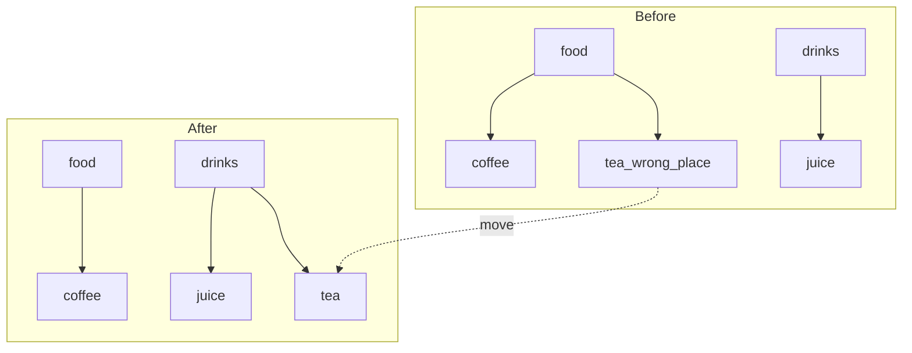
```mermaid {scale: 0.7}
graph TB
    subgraph Before
        F[food]
        C[coffee]
        T[tea_wrong_place]
        F --> C & T

        D[drinks]
        J[juice]
        D --> J
    end

    subgraph After
        F2[food]
        C2[coffee]
        F2 --> C2

        D2[drinks]
        J2[juice]
        T2[tea]
        D2 --> J2 & T2
    end

    T -.->|move| T2
```

</div>

</div>

---

# RebalancePlan：组合操作

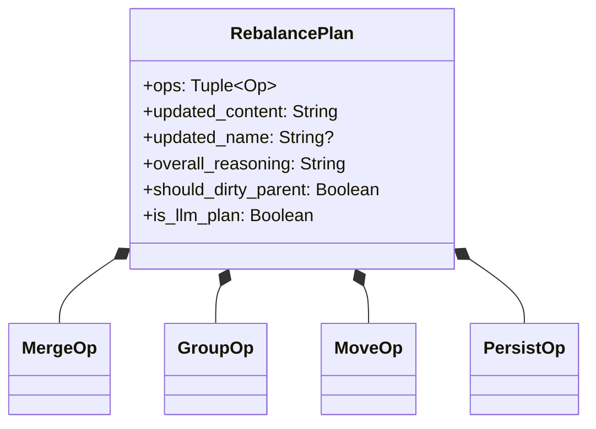
```mermaid {scale: 0.8}
classDiagram
    class RebalancePlan {
        +ops: Tuple~Op~
        +updated_content: String
        +updated_name: String?
        +overall_reasoning: String
        +should_dirty_parent: Boolean
        +is_llm_plan: Boolean
    }

    class MergeOp
    class GroupOp
    class MoveOp
    class PersistOp

    RebalancePlan *-- MergeOp
    RebalancePlan *-- GroupOp
    RebalancePlan *-- MoveOp
    RebalancePlan *-- PersistOp
```

<div class="mt-4 text-center">

| 字段 | 作用 |
|-----|------|
| `ops` | 有序操作序列 |
| `updated_content` | 父类目新摘要 |
| `should_dirty_parent` | 触发语义浮动？ |

</div>

---

# UpdateContext：维护上下文

<div class="grid grid-cols-2 gap-8">

<div>

### 上下文快照

```python
UpdateContext {
    parent          # 当前类目
    active_nodes    # 稳定子节点
    pending_nodes   # 待处理碎片
    sibling_categories  # 同级类目
    ancestor_categories # 祖先链
}
```

<v-click>

### 用途

- Strategy 决策依据
- Executor 节点查找
- LLM Prompt 构建

</v-click>

</div>

<div>

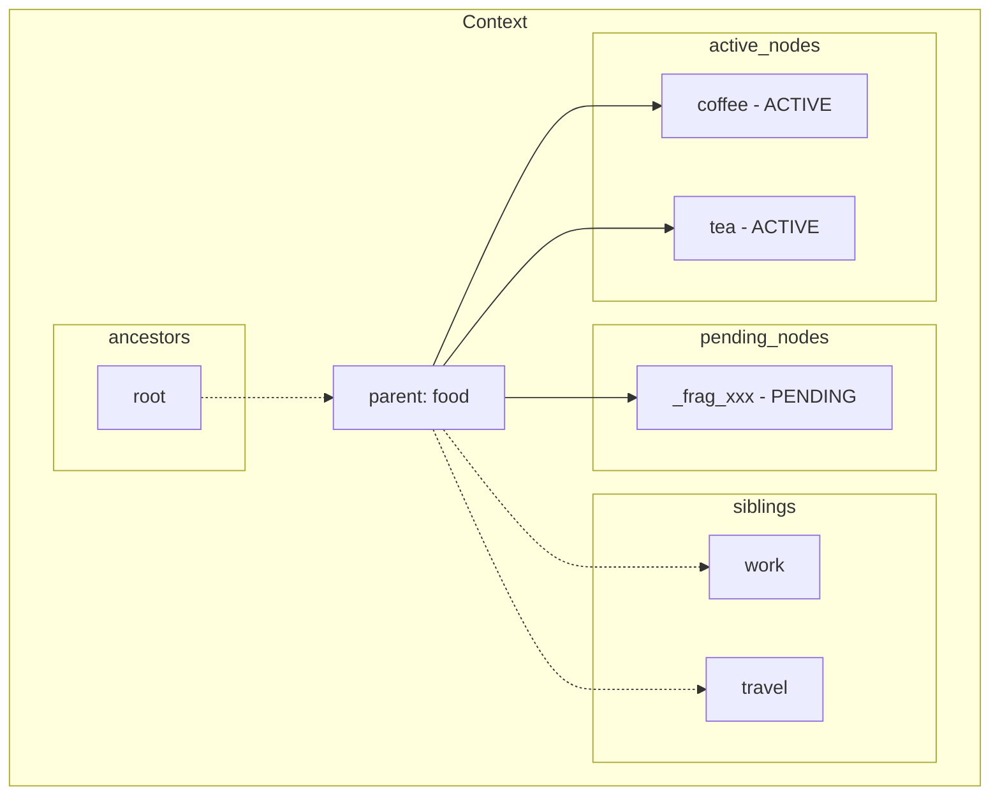
```mermaid {scale: 0.65}
graph TB
    subgraph Context
        PA[parent: food]

        subgraph active_nodes
            A1[coffee - ACTIVE]
            A2[tea - ACTIVE]
        end

        subgraph pending_nodes
            P1[_frag_xxx - PENDING]
        end

        subgraph siblings
            S1[work]
            S2[travel]
        end

        subgraph ancestors
            AN[root]
        end
    end

    PA --> A1 & A2
    PA --> P1
    PA -.-> S1 & S2
    AN -.-> PA
```

</div>

</div>

---

# Strategy 策略模式

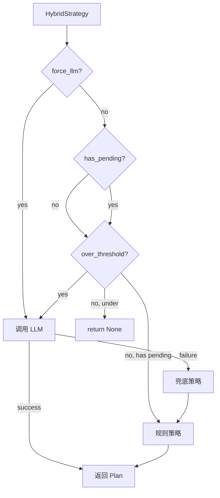
```mermaid {scale: 0.85}
graph TB
    S[HybridStrategy]

    S --> D1{force_llm?}
    D1 -->|yes| LLM[调用 LLM]
    D1 -->|no| D2{has_pending?}

    D2 -->|no| D3{over_threshold?}
    D2 -->|yes| D3

    D3 -->|no, under| SKIP[return None]
    D3 -->|yes| LLM
    D3 -->|no, has pending| RULE[规则策略]

    LLM -->|success| RETURN[返回 Plan]
    LLM -->|failure| FALLBACK[兜底策略]
    FALLBACK --> RULE
    RULE --> RETURN
```

<div class="mt-4 text-center text-sm text-gray-500">
LLM 失败时自动降级到规则策略，保证可用性
</div>

---

# Executor 执行器

<div class="grid grid-cols-2 gap-8">

<div>

### 设计原则

<v-clicks>

- **Zero SQL**：通过 UoW 注册变更
- **快照一致性**：使用 Context 查找
- **LLM容错**：跳过无效 ID
- **短ID支持**：匹配8字符前缀
- **调用方控制**：从不自动提交

</v-clicks>

</div>

<div>

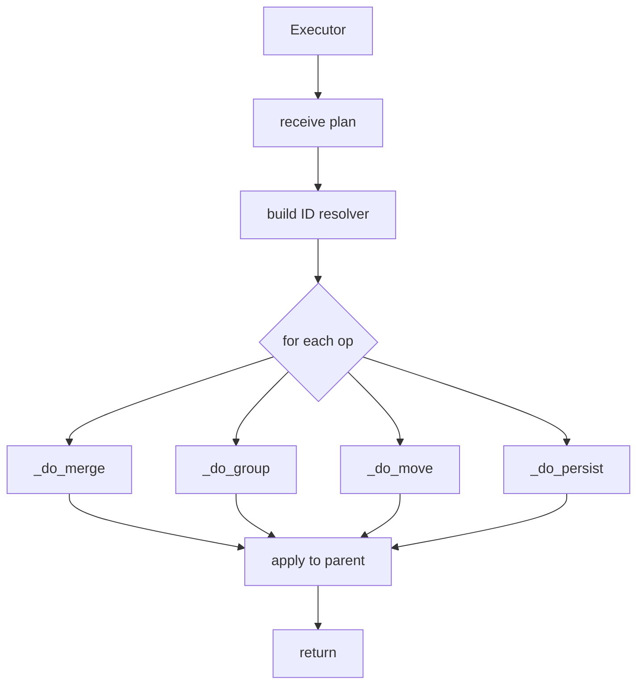
```mermaid {scale: 0.7}
graph TB
    E[Executor]

    E --> R[receive plan]
    R --> B[build ID resolver]
    B --> L{for each op}

    L --> M[_do_merge]
    L --> G[_do_group]
    L --> MV[_do_move]
    L --> P[_do_persist]

    M & G & MV & P --> U[apply to parent]
    U --> RET[return]
```

</div>

</div>

---

# 语义浮动 Semantic Floating

<div class="grid grid-cols-2 gap-8">

<div>

### 机制

当深层结构变化影响上层语义时，向上传播维护需求

```python
if plan.should_dirty_parent:
    grandparent.request_semantic_rethink()
    # 设置 _force_llm = True
```

<v-click>

### 触发场景

- GroupOp 创建新子类目
- MergeOp 显著改变内容结构
- 任何需要父节点理解的变化

</v-click>

</div>

<div>

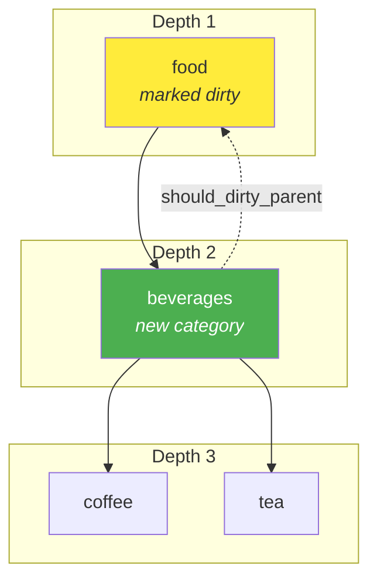
```mermaid {scale: 0.7}
graph TB
    subgraph "Depth 1"
        F[food<br/><i>marked dirty</i>]
    end

    subgraph "Depth 2"
        B[beverages<br/><i>new category</i>]
    end

    subgraph "Depth 3"
        C[coffee]
        T[tea]
    end

    F --> B
    B --> C & T

    B -.->|should_dirty_parent| F

    style F fill:#ffeb3b
    style B fill:#4caf50,color:#fff
```

<div class="text-sm text-gray-400 mt-2">
下次 maintain() 时 food 将被 LLM 重新分析
</div>

</div>

</div>

---

# Unit of Work 事务模式

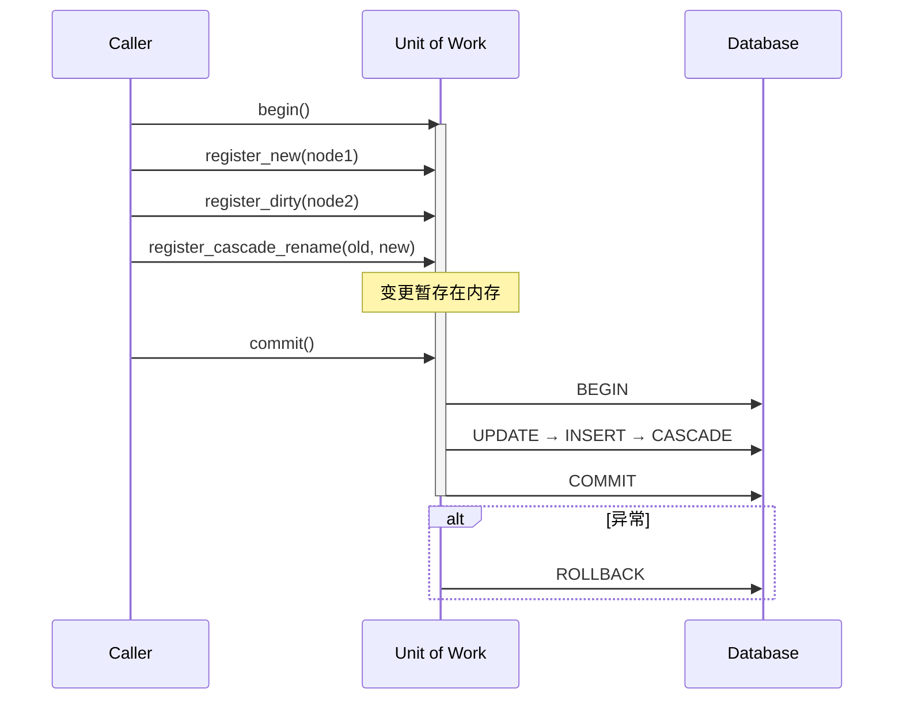
```mermaid {scale: 0.8}
sequenceDiagram
    participant C as Caller
    participant UoW as Unit of Work
    participant DB as Database

    C->>UoW: begin()
    activate UoW

    C->>UoW: register_new(node1)
    C->>UoW: register_dirty(node2)
    C->>UoW: register_cascade_rename(old, new)

    Note over UoW: 变更暂存在内存

    C->>UoW: commit()
    UoW->>DB: BEGIN
    UoW->>DB: UPDATE → INSERT → CASCADE
    UoW->>DB: COMMIT

    deactivate UoW

    alt 异常
        UoW->>DB: ROLLBACK
    end
```

<div class="text-center mt-4">
**原子性保证**：要么全部成功，要么全部回滚
</div>

---

# LLM 三种角色

<div class="grid grid-cols-3 gap-6">

<div class="bg-blue-50 p-4 rounded-lg">

### 📝 记忆写入者

```python
await semafs.write(
    "root.preferences.food",
    "喜欢深烘焙咖啡",
    {"source": "chat"}
)
```

创建 PENDING_REVIEW 碎片

</div>

<div class="bg-green-50 p-4 rounded-lg">

### 🔍 记忆查询者

```python
# 精确读取
node = await semafs.read(path)

# 树形浏览
tree = await semafs.view_tree(
    path, max_depth=2
)
```

通过 Renderer 输出

</div>

<div class="bg-purple-50 p-4 rounded-lg">

### 🧠 记忆组织者

```python
# 维护阶段自动调用
plan = await strategy.create_plan(
    context
)
# 返回 merge/group/move 操作
```

Tool Calling 强制 JSON

</div>

</div>

---

# LLM Prompt 结构

<div class="grid grid-cols-2 gap-4">

<div class="text-sm">

### System Prompt

```
你是知识组织专家。
可用操作：MERGE, GROUP, MOVE
约束：
- 合并保留所有具体值
- 移动只能到已存在类目
- 目标每类目最多 N 个子节点
```

### User Prompt

```
## 当前类目: root.preferences.food
## 摘要: "饮食偏好概览..."

## 稳定节点:
- [id: abc12345] LEAF | coffee | "深烘焙..."

## 待处理:
- [id: def67890] LEAF | _frag_xxx | "浅烘焙..."

## 可移动目标: root.drinks
## 同级类目: [work, travel]
```

</div>

<div class="text-sm">

### Tool Schema

```json
{
  "name": "tree_ops",
  "parameters": {
    "ops": [{
      "op_type": "MERGE",
      "ids": ["abc12345", "def67890"],
      "content": "咖啡偏好：深烘焙为主，
                  开始尝试浅烘焙...",
      "reasoning": "两条都关于咖啡"
    }],
    "updated_content": "饮食偏好更新...",
    "should_dirty_parent": false
  }
}
```

<div class="mt-4 text-gray-500">
强制 Tool Calling 确保返回有效 JSON
</div>

</div>

</div>

---

# 系统属性

<div class="grid grid-cols-2 gap-8">

<div>

### 不变量

| 约束 | 实施 |
|-----|------|
| 路径唯一 | DB UNIQUE 约束 |
| Root 不可变 | 应用逻辑 |
| Leaf 终端性 | 领域模型 |
| 合并无损 | Prompt 约束 |
| 事务原子 | UoW 模式 |

</div>

<div>

### 性能特征

| 操作 | 复杂度 |
|-----|--------|
| Write | O(1) |
| Read | O(depth) |
| List | O(children) |
| Maintain | O(dirty × LLM) |

### 优化

- 并行 Context 获取
- 祖先链限3层
- 短ID省token

</div>

</div>

---

# 完整维护示例

<div class="grid grid-cols-2 gap-4 text-sm">

<div>

### Before

```
root/
├── coffee_note_1: "深烘焙"
├── coffee_note_2: "埃塞俄比亚"
├── tea_preference: "绿茶无糖"
└── _frag_abc: "尝试手冲" (PENDING)
```

</div>

<div>

### After maintain()

```
root/
├── beverages/           ← GroupOp
│   ├── coffee/          ← 嵌套
│   │   └── preferences  ← MergeOp
│   │       "深烘焙，埃塞俄比亚，
│   │        手冲方法"
│   └── tea: "绿茶无糖"  ← 移入
└── [ARCHIVED × 4]
```

</div>

</div>

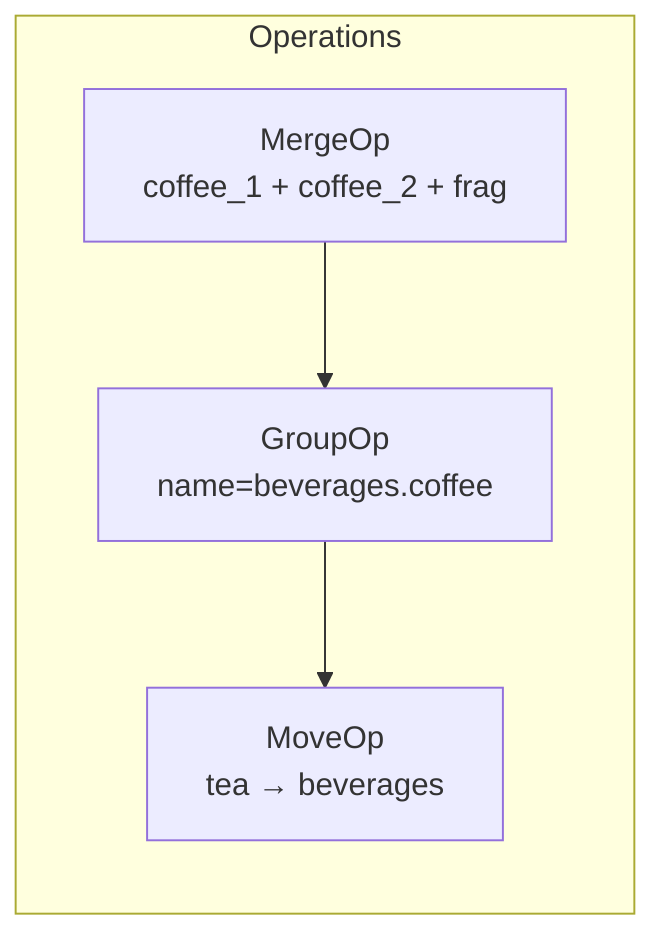
```mermaid {scale: 0.6}
graph LR
    subgraph "Operations"
        M[MergeOp<br/>coffee_1 + coffee_2 + frag]
        G[GroupOp<br/>name=beverages.coffee]
        MV[MoveOp<br/>tea → beverages]
    end

    M --> G --> MV
```

---
layout: center
---

# 总结

<div class="grid grid-cols-2 gap-8 mt-8">

<div>

### 核心贡献

<v-clicks>

1. **层次化记忆模型**
   - 双节点类型
   - 精确度梯度

2. **语义重组操作**
   - Merge / Group / Move
   - 形式化定义

3. **Write-Maintain 架构**
   - 低延迟写入
   - 批量优化

4. **LLM 深度集成**
   - 三种角色
   - Tool Calling

</v-clicks>

</div>

<div>

### 设计亮点

<v-clicks>

- **六边形架构**
  - 易于替换存储/LLM

- **语义浮动**
  - 自底向上一致性

- **优雅降级**
  - 规则策略兜底

- **事务安全**
  - UoW 原子操作

</v-clicks>

</div>

</div>

---
layout: center
class: text-center
---

# 未来方向

<div class="grid grid-cols-4 gap-6 mt-8">

<div class="bg-gray-50 p-4 rounded-lg">
  <div class="text-3xl mb-2">🖼️</div>
  <div class="font-bold">多模态</div>
  <div class="text-sm text-gray-600">图像、音频知识</div>
</div>

<div class="bg-gray-50 p-4 rounded-lg">
  <div class="text-3xl mb-2">🔗</div>
  <div class="font-bold">知识图谱</div>
  <div class="text-sm text-gray-600">跨类目语义链接</div>
</div>

<div class="bg-gray-50 p-4 rounded-lg">
  <div class="text-3xl mb-2">🔍</div>
  <div class="font-bold">向量索引</div>
  <div class="text-sm text-gray-600">语义相似检索</div>
</div>

<div class="bg-gray-50 p-4 rounded-lg">
  <div class="text-3xl mb-2">🌐</div>
  <div class="font-bold">分布式</div>
  <div class="text-sm text-gray-600">大规模知识库</div>
</div>

</div>

---
layout: center
class: text-center
---

# Thank You

<div class="text-2xl mt-8 text-gray-600">
SemaFS: 让 LLM 拥有结构化的长期记忆
</div>

<div class="mt-12 text-gray-400">
Questions?
</div>

---
layout: end
---

# Appendix

---

# A. 数据库 Schema

```sql {all|1-8|10-15|17-22}
CREATE TABLE semafs_nodes (
    id TEXT PRIMARY KEY,
    parent_path TEXT NOT NULL,
    name TEXT NOT NULL,
    node_type TEXT CHECK(node_type IN ('CATEGORY', 'LEAF')),
    status TEXT CHECK(status IN ('ACTIVE', 'ARCHIVED',
                                  'PENDING_REVIEW', 'PROCESSING')),
    content TEXT,

    display_name TEXT,
    name_editable INTEGER DEFAULT 1,
    payload TEXT DEFAULT '{}',
    tags TEXT DEFAULT '[]',
    is_dirty INTEGER DEFAULT 0,
    version INTEGER DEFAULT 1,

    access_count INTEGER DEFAULT 0,
    created_at TEXT,
    updated_at TEXT,
    last_accessed_at TEXT
);

-- 非归档节点路径唯一
CREATE UNIQUE INDEX idx_unique_path
    ON semafs_nodes(parent_path, name)
    WHERE status != 'ARCHIVED';
```

---

# B. 状态转换完整图

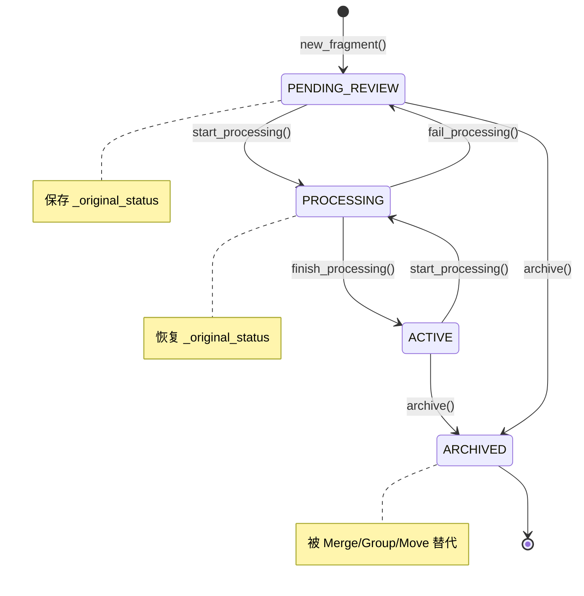
```mermaid
stateDiagram-v2
    [*] --> PENDING_REVIEW: new_fragment()

    PENDING_REVIEW --> PROCESSING: start_processing()
    note right of PENDING_REVIEW: 保存 _original_status

    PROCESSING --> ACTIVE: finish_processing()
    PROCESSING --> PENDING_REVIEW: fail_processing()
    note right of PROCESSING: 恢复 _original_status

    ACTIVE --> PROCESSING: start_processing()
    ACTIVE --> ARCHIVED: archive()

    PENDING_REVIEW --> ARCHIVED: archive()
    note right of ARCHIVED: 被 Merge/Group/Move 替代

    ARCHIVED --> [*]
```

---

# C. 故障恢复流程

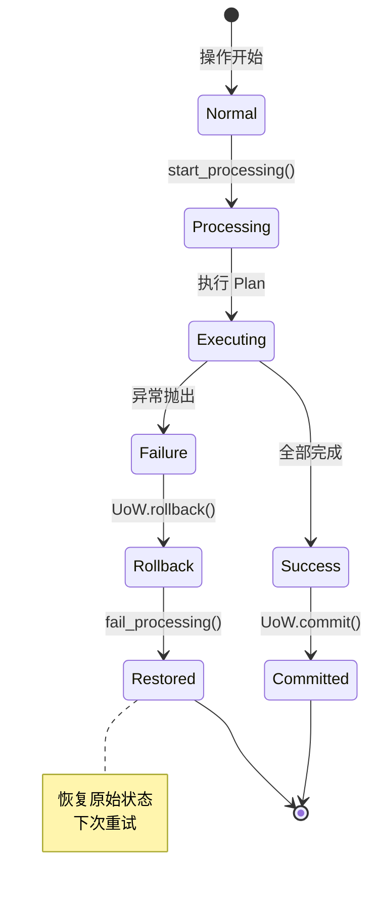
```mermaid
stateDiagram-v2
    [*] --> Normal: 操作开始

    Normal --> Processing: start_processing()
    Processing --> Executing: 执行 Plan

    Executing --> Success: 全部完成
    Executing --> Failure: 异常抛出

    Success --> Committed: UoW.commit()
    Failure --> Rollback: UoW.rollback()

    Rollback --> Restored: fail_processing()
    note right of Restored: 恢复原始状态<br/>下次重试

    Committed --> [*]
    Restored --> [*]
```

<div class="mt-4 text-center text-sm text-gray-500">
失败的类目保持 dirty 状态，下次 maintain() 自动重试
</div>
