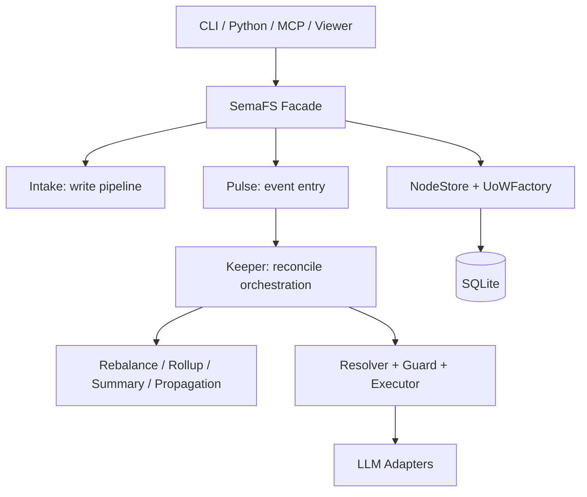

# SemaFS

Semantic filesystem for LLM memory.

SemaFS stores knowledge fragments in a canonical tree (`root.*`) and automatically maintains structure through event-driven reconcile. The project provides four runtime surfaces:

- Python API (`SemaFS` facade)
- CLI (`semafs ...`)
- MCP server (`semafs serve`)
- Web viewer (`semafs view`)

## 1. Why SemaFS

SemaFS is built for systems that need memory to be:

- Explainable: explicit canonical paths, not opaque vector-only buckets
- Maintainable: structured reconcile pipeline instead of ad-hoc mutation
- Safe to mutate: transactional updates with deterministic path projection
- Extensible: strategy and infrastructure boundaries through ports

## 2. Architecture Snapshot



## 3. Installation

```bash
pip install semafs

# Provider extras
pip install "semafs[openai]"
pip install "semafs[anthropic]"

# MCP server
pip install "semafs[mcp]"

# Web viewer
pip install "semafs[server]"

# Everything
pip install "semafs[all]"
```

Python requirement: `>=3.10`.

## 4. Quick CLI Flow

```bash
export OPENAI_API_KEY="sk-..."

semafs write "User prefers async updates" \
  --hint root.work \
  --provider openai \
  --db data/demo.db

semafs tree root --provider openai --db data/demo.db --max-depth 3
semafs stats --provider openai --db data/demo.db --output json

# optional backlog sweep
semafs sweep --provider openai --db data/demo.db --limit 20
```

Notes:

- Runtime commands `write/read/list/tree/stats/sweep/serve` require `--provider`.
- `view` does not require provider credentials.

## 5. Python Example

```python
import asyncio

from openai import AsyncOpenAI

from semafs import SemaFS
from semafs.algo import (
    DefaultPolicy,
    HybridStrategy,
    LLMSummarizer,
    LLMRecursivePlacer,
    PlacementConfig,
)
from semafs.infra.bus import InMemoryBus
from semafs.infra.llm.openai import OpenAIAdapter
from semafs.infra.storage.sqlite.store import SQLiteStore
from semafs.infra.storage.sqlite.uow import SQLiteUoWFactory


async def main() -> None:
    store = SQLiteStore("data/demo_py.db")
    uow_factory = SQLiteUoWFactory(store)
    await uow_factory.init()

    adapter = OpenAIAdapter(AsyncOpenAI(), model="gpt-4o-mini")

    fs = SemaFS(
        store=store,
        uow_factory=uow_factory,
        bus=InMemoryBus(),
        strategy=HybridStrategy(adapter),
        placer=LLMRecursivePlacer(
            store=store,
            adapter=adapter,
            config=PlacementConfig(max_depth=4, min_confidence=0.55),
        ),
        summarizer=LLMSummarizer(adapter),
        policy=DefaultPolicy(),
    )

    leaf_id = await fs.write("Coffee: dark roast", hint="root.preferences")
    print("leaf_id:", leaf_id)

    tree = await fs.tree("root", max_depth=2)
    if tree:
        print(tree.path, tree.total_nodes)


asyncio.run(main())
```

## 6. MCP Server

```bash
semafs serve --provider openai --db data/demo.db
```

Tools exposed:

- `write`
- `read`
- `list`
- `tree`
- `stats`
- `sweep`

## 7. Web Viewer

```bash
semafs view --db data/demo.db --host 127.0.0.1 --port 8080
```

Viewer HTTP endpoints include:

- `GET /api/stats`
- `GET /api/root`
- `GET /api/node/{node_id}`
- `GET /api/node/{node_id}/children`
- `GET /api/node/{node_id}/ancestors`
- `GET /api/path?path=root.xxx`
- `GET /api/search?q=...`

## 8. Demos

Use runnable demos in `demos/`:

- `demo_self_organization.py` (LLM-dependent)
- `demo_tool_call_simulation.py` (simulated tool loop over SQLite)

### 8.1 Demo: Self-Organization

```bash
export OPENAI_API_KEY="sk-..."

python -m demos.demo_self_organization \
  --provider openai \
  --db data/demo_self_organization.db \
  --reset \
  --data-size 24 \
  --soft 4 --hard 6
```

### 8.2 Demo: Simulated Agent Tool Calls

Run after Demo 8.1 (or point to any populated SemaFS SQLite DB):

```bash
python -m demos.demo_tool_call_simulation \
  --db data/demo_self_organization.db \
  --query "release checklist blockers deployment" \
  --start-path root \
  --max-depth 4 \
  --branch-factor 3 \
  --show-trace
```

More details: `demos/README.md`.

## 9. Runtime Semantics

- `write()` creates a `PENDING` leaf inside a transaction and commits.
- After commit, `Placed` is published to the bus.
- `Pulse` converts events to signals and calls `Keeper.reconcile(...)`.
- `Keeper` runs staged maintenance phases under per-node lock.
- `SQLiteUnitOfWork` commits all structural changes atomically.
- Deletion semantics are archival (`is_archived=1`, `stage='archived'`).


## 10. License

[MIT](LICENSE)
