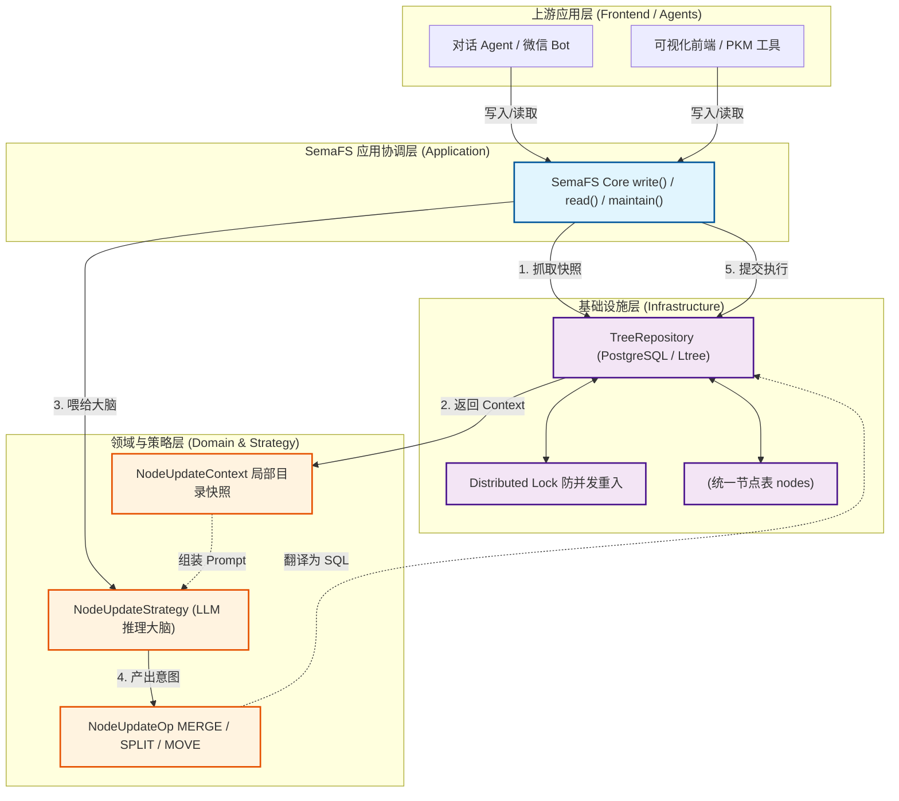
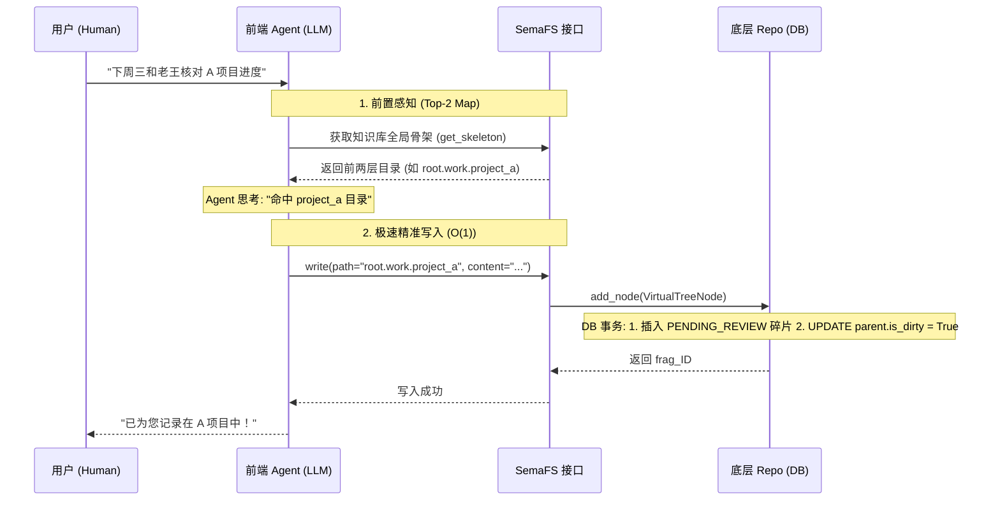
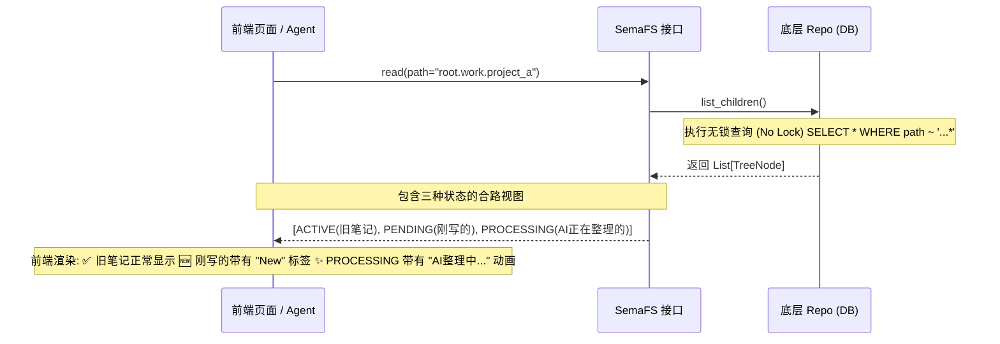
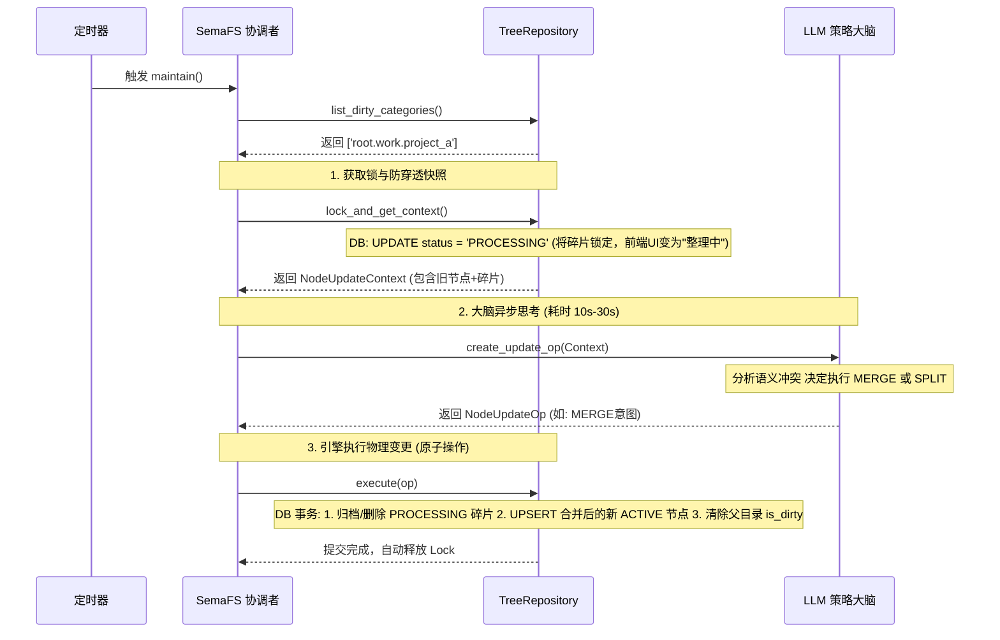
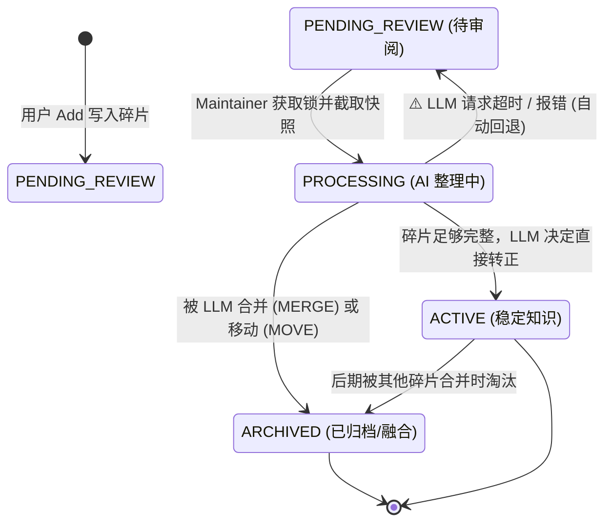

# 📊 SemaFS 全景图谱与数据流向

## 1. 系统总体架构图 (System Architecture)

展示 SemaFS 的分层架构（Clean Architecture），突出“流程控制”、“大模型策略”与“底层存储”的解耦。



---

## 2. 核心数据流一：双层智能路由与无锁写入 (Write & Active Routing Flow)

展示上游 Agent 如何利用“顶层地图”进行精准投递，以及 SemaFS 如何实现极速写入。



---

## 3. 核心数据流二：无阻塞合路读取 (Read-Your-Writes Flow)

展示在后台正在整理时，前端依然能够瞬间读取到所有数据（融合了稳定知识与处理中的碎片）。



---

## 4. 核心数据流三：后台记忆重组与自组织 (Maintain & Consolidation Flow)

这是 SemaFS **最核心的壁垒**，展示了系统如何在后台异步利用 LLM 将混沌的数据重新组织化。



---

## 5. 碎片生命周期状态机 (Status State Machine)

展示一条记忆碎片是如何在数据库中流转的，这是并发安全的基石。



---

## 🚀 运行示例

```bash
cd experimental/SemaFS

# Mock 模式（无需 API Key，使用 MockLLMAdapter 模拟 LLM）
python -m semafs.run

# OpenAI 模式（需设置 OPENAI_API_KEY）
export OPENAI_API_KEY=sk-...
python -m semafs.run --openai --model gpt-4o-mini
```

运行流程：创建分类 → 写入 23 条记忆碎片 → 读取合路视图 → `maintain()` 整理（LLM 决策）→ 再次读取整理结果。

测试数据位于 `semafs/run.py` 与 `tests/fixtures.py`，包含工作、个人、学习、想法等多类记忆碎片。

### SQLite 测试与 Markdown 导出

```bash
# 运行 SQLite 测试（含 Markdown 导出）
pip install aiosqlite
python -m pytest tests/test_semafs_sqlite.py -v

# 测试完成后，数据库与 Markdown 位于：
#   tests/output/semafs_test.db   # SQLite 数据库
#   tests/output/vault/*.md        # Markdown 视图（每个分类一个 .md）
```

---

## 💡 汇报时的演讲要点 (Talk Track)

如果你使用这些图进行汇报，可以重点引导听众关注以下几个 **“Aha Moment（顿悟时刻）”**：

1. **图 1 (架构图)**：请注意 `NodeUpdateOp` 和 `Context` 的设计。我们让大模型完全不知道数据库长什么样，它只做纯粹的“语义 Diff（补丁）”计算，这让系统极度安全且易于测试。
2. **图 2 (双层路由)**：为了防止系统“雪崩”，我们把大模型的算力做了拆分。前端的便宜模型（如 GPT-4o-mini）只看最顶层地图做“快递分拣（Add）”，后端的昂贵模型在夜间做“深度提纯（Maintain）”。
3. **图 3 (合路读取)**：这是我们解决“RAG 写入延迟”的必杀技。用户写完瞬间可读，甚至能看到 AI 正在整理的炫酷状态（`PROCESSING`），全程无数据库行锁，体验丝滑。
4. **图 5 (状态机)**：这四个状态构成了 SemaFS 的坚固护城河。即使在 LLM 思考的 30 秒内用户又疯狂发了 10 条新消息，因为状态机的严格管控，我们也**绝对不会丢失任何一条数据，也不会发生覆盖冲突**。