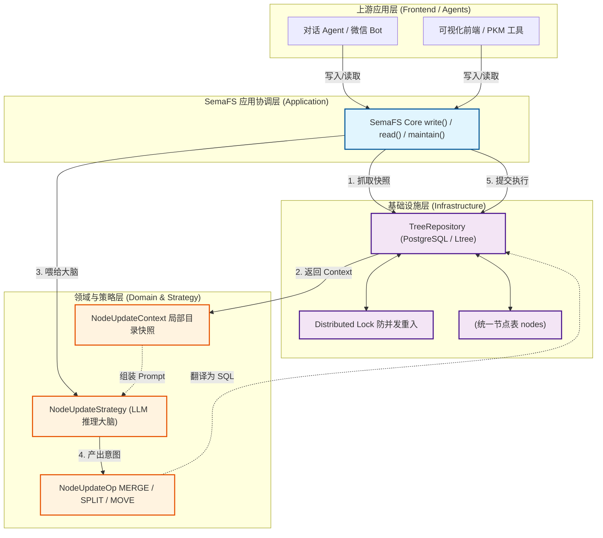

# SemaFS 

```mermaid
graph TD
   
    subgraph External["上游应用层 (Frontend / Agents)"]
        Agent[对话 Agent / 微信 Bot]
        UI[可视化前端 / PKM 工具]
    end


    subgraph Core["SemaFS 应用协调层 (Application)"]
        FS["SemaFS Core write() / read() / maintain()"]
    end

    subgraph Domain["领域与策略层 (Domain & Strategy)"]
        Strategy["NodeUpdateStrategy (LLM 推理大脑)"]
        Op["NodeUpdateOp MERGE / SPLIT / MOVE"]
        Ctx["NodeUpdateContext 局部目录快照"]
    end

    %% 基础设施层 (数据库与锁)
    subgraph Infra["基础设施层 (Infrastructure)"]
        Repo["TreeRepository (PostgreSQL / Ltree)"]
        Lock["Distributed Lock 防并发重入"]
        DB["(统一节点表 nodes)"]
    end

    %% 关联关系
    Agent -- 写入/读取 --> FS
    UI -- 写入/读取 --> FS
   

    FS -- 1. 抓取快照 --> Repo
    Repo -- 2. 返回 Context --> Ctx
    FS -- 3. 喂给大脑 --> Strategy
    Ctx -. 组装 Prompt .-> Strategy
    Strategy -- 4. 产出意图 --> Op
    FS -- 5. 提交执行 --> Repo
    Op -. 翻译为 SQL .-> Repo
    
    Repo <--> DB
    Repo <--> Lock

    classDef core fill:#e1f5fe,stroke:#01579b,stroke-width:2px;
    classDef domain fill:#fff3e0,stroke:#e65100,stroke-width:2px;
    classDef infra fill:#f3e5f5,stroke:#4a148c,stroke-width:2px;
    class FS core;
    class Strategy,Op,Ctx domain;
    class Repo,DB,Lock infra;
```
